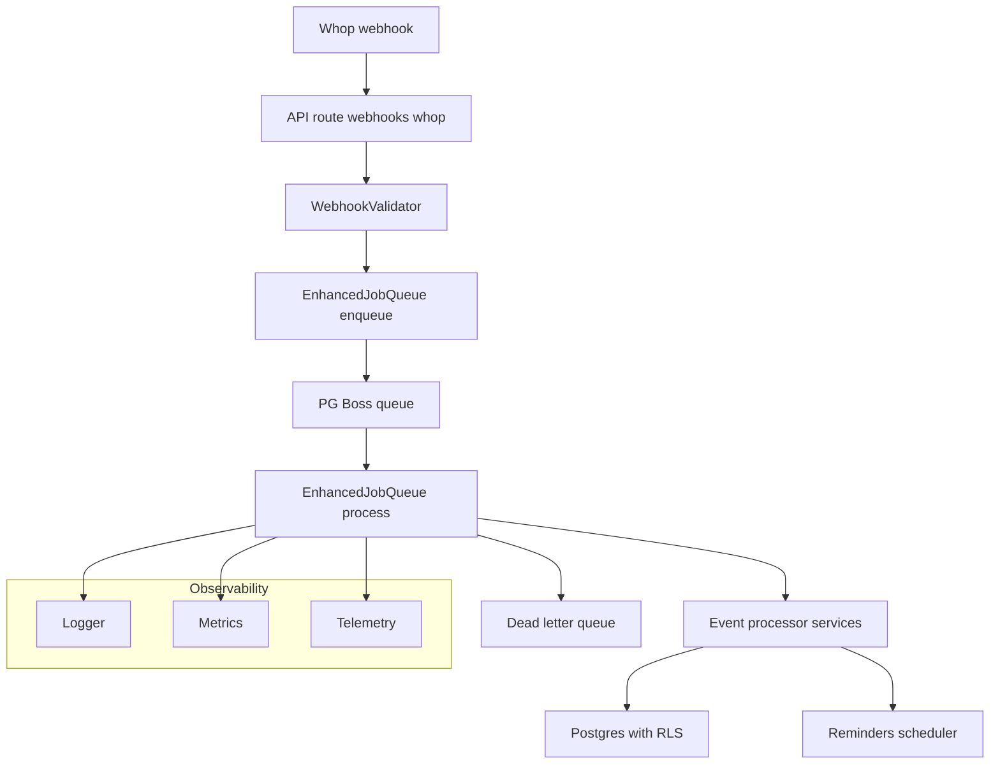

# Architecture: ChurnSaver

System overview
- Multi‑tenant retention automation platform built on Next.js (App Router) with a robust webhook ingestion pipeline, PG Boss–backed background processing, strict PostgreSQL Row‑Level Security, and comprehensive observability.
- Security-first posture: signature validation, timestamp skew checks, replay protection, rate limiting, request-size control, structured logs with redaction, and application‑layer encryption.

System diagram (textual)

Core components and boundaries
- Web app and API surface
  - Web UI: [apps/web/src/app/page.tsx](apps/web/src/app/page.tsx), [apps/web/src/app/layout.tsx](apps/web/src/app/layout.tsx)
  - Webhook endpoint: [apps/web/src/app/api/webhooks/whop/route.ts](apps/web/src/app/api/webhooks/whop/route.ts) with [POST()](apps/web/src/app/api/webhooks/whop/route.ts:9)
- Webhook validation and Whop integration
  - Validator: [apps/web/src/lib/whop/webhookValidator.ts](apps/web/src/lib/whop/webhookValidator.ts)
    - [parseSignatureHeader()](apps/web/src/lib/whop/webhookValidator.ts:124)
    - [validateWebhookSignature()](apps/web/src/lib/whop/webhookValidator.ts:154)
    - [validateTimestamp()](apps/web/src/lib/whop/webhookValidator.ts:200)
    - [WebhookValidator.validateWebhook()](apps/web/src/lib/whop/webhookValidator.ts:339)
  - Whop SDK/config and helpers: [apps/web/src/lib/whop/index.ts](apps/web/src/lib/whop/index.ts), [apps/web/src/lib/whop/sdkConfig.ts](apps/web/src/lib/whop/sdkConfig.ts), [apps/web/src/lib/whop/auth.ts](apps/web/src/lib/whop/auth.ts)
  - Docs and runbooks: [apps/web/docs/whop-api-reference.md](apps/web/docs/whop-api-reference.md), [apps/web/docs/whop-sdk-integration-guide.md](apps/web/docs/whop-sdk-integration-guide.md), [apps/web/docs/whop-production-runbook.md](apps/web/docs/whop-production-runbook.md)
- Request controls and rate limiting
  - Rate limiting middleware: [apps/web/src/server/middleware/rateLimit.ts](apps/web/src/server/middleware/rateLimit.ts)
  - Redis-backed limiter utilities: [apps/web/src/lib/rateLimitRedis.ts](apps/web/src/lib/rateLimitRedis.ts)
  - Request-size limits: [apps/web/src/middleware/requestSizeLimit.ts](apps/web/src/middleware/requestSizeLimit.ts)
- Queueing, jobs, and resiliency
  - Enhanced job queue: [apps/web/src/server/services/enhancedJobQueue.ts](apps/web/src/server/services/enhancedJobQueue.ts)
    - [enqueueWebhookJob()](apps/web/src/server/services/enhancedJobQueue.ts:222)
    - [processEnhancedWebhookJob()](apps/web/src/server/services/enhancedJobQueue.ts:312)
    - [processEnhancedReminderJob()](apps/web/src/server/services/enhancedJobQueue.ts:461)
    - [calculateRetryDelay()](apps/web/src/server/services/enhancedJobQueue.ts:598)
    - [getCircuitBreaker()](apps/web/src/server/services/enhancedJobQueue.ts:566)
    - [moveToDeadLetterQueue()](apps/web/src/server/services/enhancedJobQueue.ts:749)
    - [recordJobMetrics()](apps/web/src/server/services/enhancedJobQueue.ts:797)
  - Base queue service: [apps/web/src/server/services/jobQueue.ts](apps/web/src/server/services/jobQueue.ts)
  - Queue metrics: [apps/web/src/lib/jobQueueMetrics.ts](apps/web/src/lib/jobQueueMetrics.ts)
  - Dead-letter queue: [apps/web/src/lib/deadLetterQueue.ts](apps/web/src/lib/deadLetterQueue.ts)
  - Circuit breaker: [apps/web/src/lib/circuitBreaker.ts](apps/web/src/lib/circuitBreaker.ts)
- Business services and schedulers
  - Event processing: [apps/web/src/server/services/eventProcessor.ts](apps/web/src/server/services/eventProcessor.ts)
  - Cases and incentives: [apps/web/src/server/services/cases.ts](apps/web/src/server/services/cases.ts), [apps/web/src/server/services/incentives.ts](apps/web/src/server/services/incentives.ts)
  - Scheduler and reminders: [apps/web/src/server/services/scheduler.ts](apps/web/src/server/services/scheduler.ts), [apps/web/src/server/cron/processReminders.ts](apps/web/src/server/cron/processReminders.ts)
- Multi‑tenant data access and RLS
  - DB access: [apps/web/src/lib/db.ts](apps/web/src/lib/db.ts), [apps/web/src/lib/db-rls.ts](apps/web/src/lib/db-rls.ts)
  - RLS middleware and helpers: [apps/web/src/lib/rls-middleware.ts](apps/web/src/lib/rls-middleware.ts)
    - [withRLSContext()](apps/web/src/lib/rls-middleware.ts:14)
    - [withRLSProtection()](apps/web/src/lib/rls-middleware.ts:124)
    - [withSystemRLSContext()](apps/web/src/lib/rls-middleware.ts:198)
    - [validateRLSContext()](apps/web/src/lib/rls-middleware.ts:263)
  - Migrations enforcing RLS and policies:
    - Base schema and idempotency: [infra/migrations/001_init.sql](infra/migrations/001_init.sql)
    - RLS policies and helpers: [infra/migrations/002_enable_rls_policies.sql](infra/migrations/002_enable_rls_policies.sql)
    - A/B testing schema: [infra/migrations/004_add_ab_testing.sql](infra/migrations/004_add_ab_testing.sql)
    - Event security and timestamps: [infra/migrations/005_secure_events.sql](infra/migrations/005_secure_events.sql), [infra/migrations/006_backfill_occurred_at.sql](infra/migrations/006_backfill_occurred_at.sql)
    - Performance and keys: [infra/migrations/008_performance_indexes.sql](infra/migrations/008_performance_indexes.sql), [infra/migrations/009_foreign_keys.sql](infra/migrations/009_foreign_keys.sql)
- Security, privacy, and compliance
  - Encryption utilities: [apps/web/src/lib/encryption.ts](apps/web/src/lib/encryption.ts)
    - [encrypt()](apps/web/src/lib/encryption.ts:91), [decrypt()](apps/web/src/lib/encryption.ts:131)
  - Security monitoring and categorization: [apps/web/src/lib/security-monitoring.ts](apps/web/src/lib/security-monitoring.ts), [apps/web/src/lib/errorCategorization.ts](apps/web/src/lib/errorCategorization.ts)
  - Error monitoring integration: [apps/web/src/lib/errorMonitoringIntegration.ts](apps/web/src/lib/errorMonitoringIntegration.ts)

Data flow (end‑to‑end)
1) Ingestion and guardrails
   - Whop sends POST to [POST()](apps/web/src/app/api/webhooks/whop/route.ts:9)
   - Rate limiting and request‑size limits applied; invalid requests rejected
   - Raw body validated: [parseSignatureHeader()](apps/web/src/lib/whop/webhookValidator.ts:124), [validateWebhookSignature()](apps/web/src/lib/whop/webhookValidator.ts:154), [validateTimestamp()](apps/web/src/lib/whop/webhookValidator.ts:200)
2) Queuing
   - Validated payload enqueued via [enqueueWebhookJob()](apps/web/src/server/services/enhancedJobQueue.ts:222)
   - Job options enforce idempotency (singletonKey), TTLs, priorities
3) Processing
   - Worker consumes via [processEnhancedWebhookJob()](apps/web/src/server/services/enhancedJobQueue.ts:312)
   - Circuit breaker [getCircuitBreaker()](apps/web/src/server/services/enhancedJobQueue.ts:566), exponential backoff [calculateRetryDelay()](apps/web/src/server/services/enhancedJobQueue.ts:598)
   - Failures recorded, metrics emitted [recordJobMetrics()](apps/web/src/server/services/enhancedJobQueue.ts:797); after max attempts, DLQ [moveToDeadLetterQueue()](apps/web/src/server/services/enhancedJobQueue.ts:749)
4) Domain logic and RLS
   - Event attribution and case workflows in services (cases/incentives/ab testing)
   - All DB operations occur under tenant context via [withRLSProtection()](apps/web/src/lib/rls-middleware.ts:124) and RLS policies in [002_enable_rls_policies.sql](infra/migrations/002_enable_rls_policies.sql)
5) Notifications and reminders
   - Scheduled reminder processing: [apps/web/src/server/cron/processReminders.ts](apps/web/src/server/cron/processReminders.ts) and [processEnhancedReminderJob()](apps/web/src/server/services/enhancedJobQueue.ts:461)
6) Observability and operations
   - Structured logs with redaction and categorization; metrics and telemetry emitted at key points; production runbooks guide rollout and incident response: [apps/web/production/README.md](apps/web/production/README.md)

Key technical decisions
- Database and multi‑tenancy
  - PostgreSQL with strict RLS policies; per‑tenant isolation enforced at DB and application levels
  - Session variables (e.g., app.current_company_id) leveraged by policies defined in [infra/migrations/002_enable_rls_policies.sql](infra/migrations/002_enable_rls_policies.sql)
- Job orchestration
  - PG Boss selected for durable, Postgres‑backed queues; jobs are singleton‑keyed by eventId for idempotency
  - Resiliency patterns: exponential backoff, jitter, circuit breakers, memory pressure controls, DLQ
- Rate limiting and request controls
  - Redis‑backed rate limiter and Next.js middleware enforce per‑endpoint limits
  - Request size capped at the edge to prevent abuse and resource exhaustion
- Security and privacy
  - HMAC‑SHA256 signatures with timing‑safe compare, timestamp skew enforcement, strict payload validation
  - Application‑level encryption using AES‑256‑GCM [encrypt()](apps/web/src/lib/encryption.ts:91), [decrypt()](apps/web/src/lib/encryption.ts:131)
- Deployment model
  - Next.js deployed on Vercel; production configuration and guardrails documented in [apps/web/production](apps/web/production)

Design patterns in use (with evidence)
- Structured logging and categorization
  - Centralized logger and categorizer: [apps/web/src/lib/logger.ts](apps/web/src/lib/logger.ts), [apps/web/src/lib/errorCategorization.ts](apps/web/src/lib/errorCategorization.ts)
- Metrics and telemetry
  - Job metrics recording [recordJobMetrics()](apps/web/src/server/services/enhancedJobQueue.ts:797)
  - Telemetry integration: [apps/web/src/lib/telemetry.ts](apps/web/src/lib/telemetry.ts), [apps/web/src/lib/queryMonitor.ts](apps/web/src/lib/queryMonitor.ts)
- Resilience primitives
  - Circuit breaker [getCircuitBreaker()](apps/web/src/server/services/enhancedJobQueue.ts:566)
  - Exponential backoff [calculateRetryDelay()](apps/web/src/server/services/enhancedJobQueue.ts:598)
  - Dead letter on max retries [moveToDeadLetterQueue()](apps/web/src/server/services/enhancedJobQueue.ts:749)
- RLS boundary in application layer
  - Middleware [withRLSProtection()](apps/web/src/lib/rls-middleware.ts:124), validation [validateRLSContext()](apps/web/src/lib/rls-middleware.ts:263)

A/B testing and optimization
- Schema: [infra/migrations/004_add_ab_testing.sql](infra/migrations/004_add_ab_testing.sql)
- Service: [apps/web/src/server/services/abTesting.ts](apps/web/src/server/services/abTesting.ts)
- Usage data model supports variant weights, usage tracking, conversions, and derived performance view

Database schema highlights (idempotency and security)
- Events table with unique whop_event_id and processing fields: [infra/migrations/001_init.sql](infra/migrations/001_init.sql)
- Security additions and timestamp integrity: [infra/migrations/005_secure_events.sql](infra/migrations/005_secure_events.sql), [infra/migrations/006_backfill_occurred_at.sql](infra/migrations/006_backfill_occurred_at.sql)
- Performance indexes and referential integrity: [infra/migrations/008_performance_indexes.sql](infra/migrations/008_performance_indexes.sql), [infra/migrations/009_foreign_keys.sql](infra/migrations/009_foreign_keys.sql)

Testing and validation coverage
- Webhooks + idempotency: [apps/web/test/webhooks.test.js](apps/web/test/webhooks.test.js), [apps/web/test/idempotency.test.ts](apps/web/test/idempotency.test.ts), [apps/web/test/webhook-invalid.test.ts](apps/web/test/webhook-invalid.test.ts)
- RLS isolation: [apps/web/test/rls-integration.test.ts](apps/web/test/rls-integration.test.ts), [apps/web/test/cross-tenant-isolation.test.ts](apps/web/test/cross-tenant-isolation.test.ts)
- Queue resiliency: [apps/web/test/enhancedJobQueue.test.ts](apps/web/test/enhancedJobQueue.test.ts), [apps/web/test/enhancedErrorRecovery.test.ts](apps/web/test/enhancedErrorRecovery.test.ts)
- Security controls: [apps/web/test/requestSizeLimit.test.ts](apps/web/test/requestSizeLimit.test.ts), [apps/web/test/rate-limiter-cleanup.test.ts](apps/web/test/rate-limiter-cleanup.test.ts), [apps/web/test/security-monitoring-session-invalidation.test.ts](apps/web/test/security-monitoring-session-invalidation.test.ts)