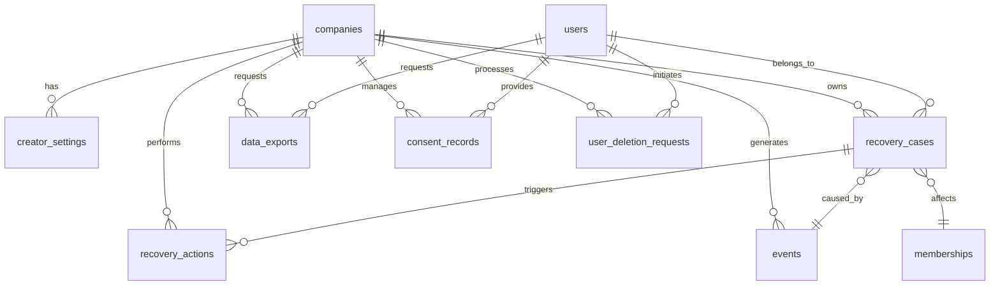

# Database Documentation

## Overview

The Churn Saver database is built on PostgreSQL with a focus on data security, performance, and multi-tenancy. This documentation covers the database schema, relationships, security policies, migration procedures, and operational guidelines.

## Table of Contents

1. [Database Architecture](#database-architecture)
2. [Security Model](#security-model)
3. [Performance Optimization](#performance-optimization)
4. [Migration Guide](#migration-guide)
5. [Backup and Recovery](#backup-and-recovery)
6. [Monitoring and Maintenance](#monitoring-and-maintenance)

## Database Architecture

### Core Principles

The database follows these architectural principles:

1. **Multi-Tenancy**: Row-Level Security (RLS) for data isolation
2. **Audit Trail**: Comprehensive logging of all data changes
3. **Data Privacy**: Encryption and anonymization where required
4. **Performance**: Optimized queries and strategic indexing
5. **Scalability**: Designed for horizontal scaling

### Database Schema Overview



### Key Tables

#### Core Tables

- **`companies`** - Multi-tenant company information
- **`users`** - User profiles and authentication
- **`memberships`** - Subscription and membership data
- **`events`** - Webhook event processing and idempotency
- **`recovery_cases`** - Churn recovery case management

#### Supporting Tables

- **`creator_settings`** - Company-specific configuration
- **`recovery_actions`** - Audit trail of recovery actions
- **`data_exports`** - GDPR data export tracking
- **`consent_records`** - User consent management
- **`user_deletion_requests`** - Data deletion requests

## Security Model

### Row Level Security (RLS)

All tables implement RLS policies for multi-tenant data isolation:

```sql
-- Example RLS policy for recovery_cases
CREATE POLICY company_isolation ON recovery_cases
FOR ALL TO authenticated_role
USING (company_id = current_setting('app.current_company_id'))
WITH CHECK (company_id = current_setting('app.current_company_id'));
```

### RLS Policy Categories

#### Data Isolation Policies

```sql
-- Company-based isolation
CREATE POLICY company_isolation ON table_name
FOR ALL TO authenticated_role
USING (company_id = current_setting('app.current_company_id'));

-- User-based access control
CREATE POLICY user_access ON table_name
FOR SELECT TO authenticated_role
USING (user_id = current_setting('app.current_user_id'));
```

#### Data Modification Policies

```sql
-- Insert restrictions
CREATE POLICY insert_control ON table_name
FOR INSERT TO authenticated_role
WITH CHECK (
  company_id = current_setting('app.current_company_id') AND
  user_id = current_setting('app.current_user_id')
);

-- Update restrictions
CREATE POLICY update_control ON table_name
FOR UPDATE TO authenticated_role
USING (
  company_id = current_setting('app.current_company_id')
);
```

### Data Encryption

Sensitive data is encrypted at multiple levels:

#### Column-Level Encryption

```sql
-- Encrypted columns
ALTER TABLE events 
ADD COLUMN payload_encrypted bytea;

-- Encryption function
CREATE OR REPLACE FUNCTION encrypt_sensitive_data(data text)
RETURNS bytea AS $$
BEGIN
  RETURN pgp_sym_encrypt(data, current_setting('app.encryption_key'));
END;
$$ LANGUAGE plpgsql SECURITY DEFINER;
```

#### Application-Level Encryption

```typescript
// Client-side encryption before storage
import { encrypt } from '@/lib/encryption';

const encryptedPayload = await encrypt(sensitiveData);
await db.query(
  'INSERT INTO events (payload_encrypted) VALUES ($1)',
  [encryptedPayload]
);
```

### Access Control

#### Database Roles

```sql
-- Application role
CREATE ROLE app_role WITH LOGIN PASSWORD 'secure_password';

-- Read-only role for analytics
CREATE ROLE analytics_readonly WITH NOLOGIN;

-- Migration role
CREATE ROLE migration_role WITH LOGIN PASSWORD 'migration_password';
```

#### Permission Grants

```sql
-- Grant table permissions
GRANT SELECT, INSERT, UPDATE, DELETE ON recovery_cases TO app_role;
GRANT SELECT ON recovery_cases TO analytics_readonly;

-- Grant function permissions
GRANT EXECUTE ON FUNCTION encrypt_sensitive_data TO app_role;
```

## Performance Optimization

### Indexing Strategy

Strategic indexing for optimal query performance:

#### Primary Indexes

```sql
-- Unique constraints for data integrity
CREATE UNIQUE INDEX idx_events_whop_event_id ON events(whop_event_id);
CREATE UNIQUE INDEX idx_recovery_cases_id ON recovery_cases(id);
CREATE UNIQUE INDEX idx_data_exports_request_id ON data_exports(request_id);
```

#### Composite Indexes

```sql
-- Multi-column indexes for common queries
CREATE INDEX idx_cases_company_status ON recovery_cases(company_id, status);
CREATE INDEX idx_cases_user_company ON recovery_cases(user_id, company_id);
CREATE INDEX idx_events_company_processed ON events(company_id, processed, created_at);
```

#### Partial Indexes

```sql
-- Indexes for specific query patterns
CREATE INDEX idx_active_cases ON recovery_cases(company_id, first_failure_at) 
WHERE status = 'open';

CREATE INDEX idx_recent_events ON events(created_at) 
WHERE created_at > NOW() - INTERVAL '7 days';
```

#### Performance Indexes

```sql
-- Covering indexes for frequent queries
CREATE INDEX idx_cases_covering ON recovery_cases(company_id, status, first_failure_at) 
INCLUDE (user_id, membership_id, attempts);
```

### Query Optimization

#### Efficient Query Patterns

```sql
-- Use CTEs for complex queries
WITH ranked_cases AS (
  SELECT 
    rc.*,
    ROW_NUMBER() OVER (PARTITION BY user_id ORDER BY first_failure_at DESC) as rn
  FROM recovery_cases rc
  WHERE rc.company_id = $1
    AND rc.status = 'open'
)
SELECT * FROM ranked_cases WHERE rn = 1;

-- Use appropriate JOIN types
SELECT 
  rc.id,
  rc.status,
  ra.type as last_action_type
FROM recovery_cases rc
LEFT JOIN LATERAL (
  SELECT type FROM recovery_actions ra2 
  WHERE ra2.case_id = rc.id 
  ORDER BY created_at DESC 
  LIMIT 1
) ra ON true
WHERE rc.company_id = $1;
```

#### Partitioning Strategy

```sql
-- Partition large tables by time
CREATE TABLE events_partitioned (
  LIKE events INCLUDING ALL
) PARTITION BY RANGE (created_at);

-- Create monthly partitions
CREATE TABLE events_2025_10 PARTITION OF events_partitioned
FOR VALUES FROM ('2025-10-01') TO ('2025-11-01');
```

### Connection Management

#### Connection Pooling

```typescript
// Database connection configuration
const poolConfig = {
  host: process.env.DB_HOST,
  port: parseInt(process.env.DB_PORT || '5432'),
  database: process.env.DB_NAME,
  user: process.env.DB_USER,
  password: process.env.DB_PASSWORD,
  max: 20, // Maximum connections
  idleTimeoutMillis: 30000,
  connectionTimeoutMillis: 2000,
  ssl: process.env.NODE_ENV === 'production'
};
```

#### Connection Monitoring

```sql
-- Monitor connection usage
SELECT 
  state,
  COUNT(*) as connection_count
FROM pg_stat_activity 
WHERE datname = current_database()
GROUP BY state;

-- Monitor long-running queries
SELECT 
  pid,
  now() - pg_stat_activity.query_start AS duration,
  query
FROM pg_stat_activity 
WHERE (now() - pg_stat_activity.query_start) > interval '5 minutes'
ORDER BY duration DESC;
```

## Migration Guide

### Migration Structure

All database migrations follow a consistent structure:

```sql
-- Migration: 001_init.sql
-- Description: Initialize core database schema
-- Author: Development Team
-- Created: 2025-10-25

-- Enable required extensions
CREATE EXTENSION IF NOT EXISTS "uuid-ossp";

-- Create tables
CREATE TABLE IF NOT EXISTS events (
  id uuid PRIMARY KEY DEFAULT uuid_generate_v4(),
  -- ... table definition
);

-- Create indexes
CREATE INDEX IF NOT EXISTS idx_events_created_at ON events(created_at);

-- RLS policies
ALTER TABLE events ENABLE ROW LEVEL SECURITY;
```

### Migration Process

#### Running Migrations

```bash
# Apply pending migrations
npm run db:migrate

# Apply specific migration
npm run db:migrate -- --migration=001_init.sql

# Rollback migration
npm run db:rollback -- --migration=001_init.sql
```

#### Migration Validation

```sql
-- Validate migration success
DO $$
DECLARE
  table_count integer;
BEGIN
  SELECT COUNT(*) INTO table_count 
  FROM information_schema.tables 
  WHERE table_schema = 'public';
  
  IF table_count < 10 THEN
    RAISE EXCEPTION 'Migration validation failed: insufficient tables';
  END IF;
END $$;
```

### Rollback Procedures

Each migration has a corresponding rollback:

```sql
-- 001_rollback.sql
-- Rollback for 001_init.sql

-- Drop tables in reverse order
DROP TABLE IF EXISTS recovery_actions;
DROP TABLE IF EXISTS recovery_cases;
DROP TABLE IF EXISTS events;

-- Drop extensions
DROP EXTENSION IF EXISTS "uuid-ossp";
```

### Migration Testing

```typescript
// Test migration in isolated environment
describe('Database Migration 001_init', () => {
  beforeEach(async () => {
    await setupTestDatabase();
  });

  afterEach(async () => {
    await cleanupTestDatabase();
  });

  test('creates required tables', async () => {
    await runMigration('001_init.sql');
    
    const tables = await getTableNames();
    expect(tables).toContain('events');
    expect(tables).toContain('recovery_cases');
  });

  test('creates indexes', async () => {
    await runMigration('001_init.sql');
    
    const indexes = await getTableIndexes('events');
    expect(indexes).toContain('idx_events_created_at');
  });
});
```

## Backup and Recovery

### Backup Strategy

#### Automated Backups

```bash
#!/bin/bash
# Daily backup script
BACKUP_DIR="/backups/$(date +%Y%m%d)"
DB_NAME="churn_saver"

# Create backup directory
mkdir -p "$BACKUP_DIR"

# Database backup
pg_dump -h localhost -U postgres -d "$DB_NAME" \
  --format=custom \
  --compress=9 \
  --verbose \
  --file="$BACKUP_DIR/database_backup.dump"

# Schema backup
pg_dump -h localhost -U postgres -d "$DB_NAME" \
  --schema-only \
  --file="$BACKUP_DIR/schema_backup.sql"

# Upload to secure storage
aws s3 cp "$BACKUP_DIR" s3://backup-bucket/database/$(date +%Y%m%d)/ \
  --recursive
```

#### Point-in-Time Recovery

```sql
-- Enable point-in-time recovery
ALTER SYSTEM SET wal_level = replica;
ALTER SYSTEM SET archive_mode = on;
ALTER SYSTEM SET archive_command = 'cp %p /archive/%f';

-- Recovery procedure
pg_ctl start -D /var/lib/postgresql/data -l recovery.conf
```

### Disaster Recovery

#### Recovery Procedures

1. **Assessment**: Determine extent of data loss
2. **Preparation**: Prepare recovery environment
3. **Execution**: Restore from latest clean backup
4. **Validation**: Verify data integrity
5. **Cut-over**: Switch to recovered database

#### Recovery Testing

```bash
# Test recovery procedures
#!/bin/bash

# Create recovery test
./scripts/test-recovery.sh

# Validate recovered data
./scripts/validate-recovery.sh

# Performance test recovered database
./scripts/performance-test.sh
```

## Monitoring and Maintenance

### Performance Monitoring

#### Query Performance

```sql
-- Slow query identification
SELECT 
  query,
  calls,
  total_time,
  mean_time,
  rows
FROM pg_stat_statements 
WHERE mean_time > 100 -- queries taking > 100ms
ORDER BY mean_time DESC
LIMIT 10;
```

#### Index Usage

```sql
-- Index effectiveness analysis
SELECT 
  schemaname,
  tablename,
  indexname,
  idx_scan,
  idx_tup_read,
  idx_tup_fetch
FROM pg_stat_user_indexes 
WHERE idx_scan > 0
ORDER BY idx_scan DESC;
```

#### Table Statistics

```sql
-- Table size and growth analysis
SELECT 
  schemaname,
  tablename,
  pg_size_pretty(pg_total_relation_size(schemaname::text || '.' || tablename::text)) as size,
  pg_total_relation_size(schemaname::text || '.' || tablename::text) as size_bytes
FROM pg_tables 
WHERE schemaname = 'public'
ORDER BY size_bytes DESC;
```

### Health Checks

#### Database Health Query

```sql
-- Comprehensive health check
SELECT 
  'database' as component,
  CASE 
    WHEN pg_is_in_recovery() THEN 'recovering'
    WHEN pg_last_xact_replay_timestamp() IS NOT NULL THEN 'catching_up'
    ELSE 'healthy'
  END as status,
  pg_size_pretty(pg_database_size(current_database())) as size,
  pg_stat_get_activity_counts().active_connections as connections,
  (SELECT COUNT(*) FROM pg_stat_activity WHERE state = 'active') as active_queries
FROM pg_database();
```

### Maintenance Procedures

#### Routine Maintenance

```sql
-- Update table statistics
ANALYZE;

-- Rebuild indexes
REINDEX DATABASE churn_saver;

-- Clean up old data
DELETE FROM events 
WHERE created_at < NOW() - INTERVAL '90 days'
AND processed = true;

-- Vacuum and analyze
VACUUM ANALYZE;
```

#### Automated Maintenance

```bash
#!/bin/bash
# Weekly maintenance script

# Update statistics
psql -d churn_saver -c "ANALYZE;"

# Rebuild fragmented indexes
psql -d churn_saver -c "REINDEX DATABASE churn_saver;"

# Clean up old data
psql -d churn_saver -c "
  DELETE FROM events 
  WHERE created_at < NOW() - INTERVAL '90 days'
  AND processed = true;
"

# Vacuum and analyze
psql -d churn_saver -c "VACUUM ANALYZE;"

# Log maintenance completion
echo "$(date): Database maintenance completed" >> /var/log/postgresql/maintenance.log
```

### Data Retention

#### Retention Policies

```sql
-- Automated data retention
CREATE OR REPLACE FUNCTION cleanup_old_data()
RETURNS void AS $$
BEGIN
  -- Clean up old processed events
  DELETE FROM events 
  WHERE created_at < NOW() - INTERVAL '90 days'
  AND processed = true;
  
  -- Clean up old export files
  DELETE FROM data_exports 
  WHERE created_at < NOW() - INTERVAL '30 days'
  AND status = 'completed';
  
  -- Clean up old consent records
  DELETE FROM consent_records 
  WHERE created_at < NOW() - INTERVAL '7 years'
  AND revoked_at IS NOT NULL;
END;
$$ LANGUAGE plpgsql;

-- Schedule cleanup job
SELECT cron.schedule(
  'cleanup-old-data',
  '0 2 * * *', -- Daily at 2 AM
  'SELECT cleanup_old_data();'
);
```

## Security Best Practices

### Access Control

1. **Principle of Least Privilege**: Minimum required permissions
2. **Role-Based Access**: Separate roles for different functions
3. **Audit Logging**: Log all data access and modifications
4. **Regular Review**: Periodic permission audits

### Data Protection

1. **Encryption at Rest**: All sensitive data encrypted
2. **Encryption in Transit**: SSL/TLS for all connections
3. **Key Management**: Secure key rotation procedures
4. **Data Masking**: Non-production environments use masked data

### Compliance

1. **GDPR Compliance**: Right to deletion and data portability
2. **Audit Trail**: Complete audit log of all changes
3. **Data Retention**: Defined retention policies
4. **Consent Management**: Explicit user consent tracking

---

**Last Updated**: 2025-10-25  
**Version**: 1.0.0