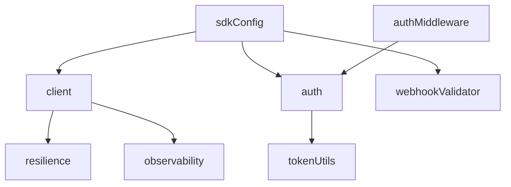

# Whop SDK Integration Guide

This comprehensive guide provides developers with detailed information on integrating and using the Whop SDK within the Churn Saver application.

## Table of Contents

1. [Overview](#overview)
2. [SDK Architecture](#sdk-architecture)
3. [Configuration Setup](#configuration-setup)
4. [Authentication & Authorization](#authentication--authorization)
5. [API Client Usage](#api-client-usage)
6. [Webhook Handling](#webhook-handling)
7. [Resilience & Error Recovery](#resilience--error-recovery)
8. [Observability Integration](#observability-integration)
9. [Security Considerations](#security-considerations)
10. [Testing & Development](#testing--development)
11. [Troubleshooting](#troubleshooting)
12. [Code Examples](#code-examples)

## Overview

The Whop SDK integration provides a robust, type-safe interface for interacting with Whop's membership, payment, and marketplace APIs. The integration includes:

- **Comprehensive SDK Modules**: Authentication, API client, webhooks, resilience, and observability
- **Production-Ready Features**: Circuit breakers, retry logic, security monitoring, and performance metrics
- **Developer Experience**: TypeScript support, comprehensive logging, and detailed error handling
- **Security-First Design**: Token validation, webhook verification, and secure configuration management

### Key Components

| Module | Purpose | Key Features |
|--------|---------|--------------|
| `sdkConfig` | Configuration management | Environment-specific settings, validation |
| `client` | API communication | HTTP client with middleware, retry logic |
| `auth` | Authentication | JWT token handling, session management |
| `webhookValidator` | Webhook security | Signature verification, replay protection |
| `resilience` | Fault tolerance | Circuit breakers, retry policies, fallbacks |
| `observability` | Monitoring | Metrics, logging, tracing |

## SDK Architecture

The Whop SDK follows a modular architecture with clear separation of concerns:

```
apps/web/src/lib/whop/
├── index.ts              # Main exports
├── sdkConfig.ts          # Configuration validation
├── client.ts             # API client with middleware
├── auth.ts               # Authentication service
├── authMiddleware.ts     # Express/Next.js middleware
├── tokenUtils.ts         # JWT utilities
├── webhookValidator.ts   # Webhook validation
├── resilience.ts         # Circuit breaker & retry logic
├── observability.ts      # Metrics & logging
└── dataTransformers.ts   # Response transformation
```

### Module Dependencies



## Configuration Setup

### Environment Variables

Configure the following environment variables in your `.env` file:

```bash
# Required for all environments
NEXT_PUBLIC_WHOP_APP_ID=app_your_app_id_here

# Required for production
WHOP_API_KEY=your_production_api_key
WHOP_WEBHOOK_SECRET=your_webhook_secret

# Optional: Development overrides
NODE_ENV=development
```

### Configuration Validation

The SDK automatically validates configuration on startup:

```typescript
import { whopConfig } from '@/lib/whop';

// Validate configuration
const validation = whopConfig.validate();
if (!validation.isValid) {
  console.error('Whop SDK configuration errors:', validation.errors);
  process.exit(1);
}

// Get validated config
const config = whopConfig.get();
console.log('Whop SDK initialized for:', config.environment);
```

### Environment-Specific Settings

| Environment | API Key Required | Webhook Secret Required | Debug Mode |
|-------------|------------------|--------------------------|------------|
| development | No | No | Yes |
| staging | Yes | Yes | No |
| production | Yes | Yes | No |

## Authentication & Authorization

### JWT Token Handling

The authentication system supports Whop's JWT tokens with automatic validation:

```typescript
import { whopAuthService } from '@/lib/whop';

// Verify JWT token
const tokenInfo = await whopAuthService.verifyToken('jwt_token_here');
console.log('User:', tokenInfo.userId, 'Company:', tokenInfo.companyId);
```

### Middleware Integration

Use authentication middleware in API routes:

```typescript
import { requireAuth, requirePermissions } from '@/lib/whop';

export const GET = requireAuth(async (request, context) => {
  const { userId, companyId } = context.auth;

  // User is authenticated
  return NextResponse.json({ userId, companyId });
});

export const POST = requirePermissions(['admin'], async (request, context) => {
  // User has admin permissions
  const data = await request.json();

  // Process admin operation
  return NextResponse.json({ success: true });
});
```

### Session Management

The SDK provides session management with automatic cleanup:

```typescript
import { whopAuthService } from '@/lib/whop';

// Create session
const session = await whopAuthService.createSession(
  userId,
  companyId,
  3600 // 1 hour TTL
);

// Validate session
const validSession = await whopAuthService.validateSession(
  userId,
  session.sessionId
);

// Revoke session
await whopAuthService.revokeSession(session.sessionId);
```

## API Client Usage

### Basic API Calls

```typescript
import { whopApiClient } from '@/lib/whop';

// GET request
const membership = await whopApiClient.get(`/memberships/${membershipId}`);

// POST request
const result = await whopApiClient.post('/memberships', {
  userId: 'user_123',
  productId: 'prod_456'
});

// PUT request
const updated = await whopApiClient.put(`/memberships/${membershipId}`, {
  status: 'active'
});
```

### Custom API Client

Create a custom client instance with specific configuration:

```typescript
import { createWhopApiClient } from '@/lib/whop';

const customClient = createWhopApiClient({
  // Custom configuration
});

// Add middleware
customClient.use({
  name: 'custom-logging',
  beforeRequest: async (options) => {
    console.log('Making request to:', options.endpoint);
    return options;
  },
  afterResponse: async (response) => {
    console.log('Response status:', response.status);
    return response;
  }
});
```

### Request Middleware

The API client supports extensible middleware:

```typescript
import { middleware } from '@/lib/whop';

// Rate limiting middleware
whopApiClient.use(middleware.rateLimit());

// Request logging middleware
whopApiClient.use(middleware.logging());

// Custom middleware
whopApiClient.use({
  name: 'request-timing',
  beforeRequest: async (options) => {
    options.headers = {
      ...options.headers,
      'X-Request-Start': Date.now().toString()
    };
    return options;
  },
  afterResponse: async (response, options) => {
    const start = parseInt(options.headers['X-Request-Start'] || '0');
    const duration = Date.now() - start;
    console.log(`Request took ${duration}ms`);
    return response;
  }
});
```

## Webhook Handling

### Webhook Endpoint Setup

Configure webhook endpoints in your Next.js API routes:

```typescript
import { NextRequest, NextResponse } from 'next/server';
import { webhookValidator, whopAuthService } from '@/lib/whop';

export async function POST(request: NextRequest) {
  try {
    // Get raw body and headers
    const body = await request.text();
    const signature = request.headers.get('x-whop-signature') || '';
    const timestamp = request.headers.get('x-whop-timestamp');

    // Validate webhook
    const validation = await webhookValidator.validateWebhook(
      body,
      signature,
      timestamp,
      JSON.parse(body)
    );

    if (!validation.isValid) {
      return NextResponse.json(
        { error: 'Invalid webhook' },
        { status: 400 }
      );
    }

    // Parse webhook payload
    const payload = JSON.parse(body);
    const { type, data, id: eventId } = payload;

    // Handle different event types
    switch (type) {
      case 'payment.succeeded':
        await handlePaymentSucceeded(data, eventId);
        break;
      case 'membership.created':
        await handleMembershipCreated(data, eventId);
        break;
      default:
        console.log('Unhandled webhook event:', type);
    }

    return NextResponse.json({ received: true });

  } catch (error) {
    console.error('Webhook processing error:', error);
    return NextResponse.json(
      { error: 'Webhook processing failed' },
      { status: 500 }
    );
  }
}
```

### Webhook Security Features

The webhook validator provides multiple security layers:

- **Signature Verification**: HMAC-SHA256 signature validation
- **Replay Attack Protection**: Timestamp-based validation
- **Event Type Validation**: Known event type enforcement
- **Payload Schema Validation**: Required field checking

### Supported Webhook Events

| Event Type | Description | Action Required |
|------------|-------------|-----------------|
| `payment.succeeded` | Payment completed successfully | Update subscription status |
| `payment.failed` | Payment failed | Trigger recovery flow |
| `membership.created` | New membership created | Provision user access |
| `membership.updated` | Membership modified | Update user permissions |
| `membership.cancelled` | Membership cancelled | Revoke user access |
| `subscription.renewed` | Subscription renewed | Update billing cycle |

## Resilience & Error Recovery

### Circuit Breaker Pattern

```typescript
import { resilienceService } from '@/lib/whop';

// Execute with circuit breaker protection
const result = await resilienceService.execute(
  async () => {
    return await whopApiClient.get('/risky-endpoint');
  },
  {
    operation: 'fetch_user_data',
    service: 'whop_api',
    requestId: 'req_123'
  }
);

// Check circuit breaker status
const state = resilienceService.getCircuitBreakerState();
console.log('Circuit breaker state:', state);
```

### Retry Logic with Exponential Backoff

```typescript
import { executeResiliently } from '@/lib/whop';

// Execute with retry logic
const userData = await executeResiliently(
  async () => {
    return await fetchUserFromWhop(userId);
  },
  {
    operation: 'get_user',
    service: 'whop_api',
    requestId: 'req_456',
    userId,
    companyId
  }
);
```

### Custom Resilience Configuration

```typescript
import { ResilienceService } from '@/lib/whop';

const customResilience = new ResilienceService({
  retryPolicy: {
    maxRetries: 5,
    baseDelay: 2000,
    maxDelay: 30000,
    backoffMultiplier: 1.5
  },
  circuitBreaker: {
    failureThreshold: 10,
    recoveryTimeout: 120000,
    name: 'custom_whop_api'
  },
  telemetry: {
    onRequestError: async (context, error, duration) => {
      // Custom error handling
      console.error('Whop API error:', error.message);
    }
  }
});
```

## Observability Integration

### Metrics Collection

The SDK automatically collects comprehensive metrics:

```typescript
// API request metrics
// - whop.api.request_started
// - whop.api.request_duration
// - whop.api.request_error

// Authentication metrics
// - whop.auth.token_verified
// - whop.auth.session_created

// Webhook metrics
// - whop.webhook.received
// - whop.webhook.validated
// - whop.webhook.processed

// Resilience metrics
// - whop.resilience.retry_attempt
// - whop.resilience.circuit_breaker_open
// - whop.resilience.circuit_breaker_close
```

### Structured Logging

All SDK operations include structured logging:

```typescript
import { logger } from '@/lib/logger';

// SDK operations automatically log:
// - Configuration loading
// - API requests/responses
// - Authentication events
// - Webhook processing
// - Error recovery actions
// - Performance metrics

// Custom logging with context
logger.info('Processing Whop webhook', {
  eventType: 'payment.succeeded',
  eventId: 'evt_123',
  userId: 'user_456',
  amount: 29.99
});
```

### Distributed Tracing

The SDK supports distributed tracing for request correlation:

```typescript
// Automatic trace context propagation
const result = await whopApiClient.get('/users', {
  headers: {
    'x-trace-id': traceId,
    'x-parent-span-id': spanId
  }
});
```

## Security Considerations

### Token Security

- JWT tokens are validated with proper signature verification
- Tokens include expiration checks and issuer validation
- Sensitive token data is sanitized in logs

### Webhook Security

- All webhooks require valid HMAC signatures
- Timestamp validation prevents replay attacks
- Payload validation ensures data integrity

### Configuration Security

- API keys and secrets are validated for strength
- Production environments require secure credentials
- Development mode includes additional security warnings

### Data Protection

- Personal data is encrypted in session storage
- Request/response logging sanitizes sensitive information
- Audit trails maintain data access history

## Testing & Development

### Unit Testing

```typescript
import { jest } from '@jest/globals';
import { whopApiClient, webhookValidator } from '@/lib/whop';

// Mock the SDK for testing
jest.mock('@whop/sdk');

// Test API client
describe('WhopApiClient', () => {
  it('should make successful API calls', async () => {
    const result = await whopApiClient.get('/test-endpoint');
    expect(result.status).toBe(200);
  });

  it('should handle API errors gracefully', async () => {
    await expect(
      whopApiClient.get('/nonexistent')
    ).rejects.toThrow('Whop API error');
  });
});

// Test webhook validation
describe('WebhookValidator', () => {
  it('should validate legitimate webhooks', async () => {
    const validation = await webhookValidator.validateWebhook(
      '{"type":"payment.succeeded"}',
      'valid_signature',
      '1634567890'
    );
    expect(validation.isValid).toBe(true);
  });

  it('should reject invalid signatures', async () => {
    const validation = await webhookValidator.validateWebhook(
      '{"type":"payment.succeeded"}',
      'invalid_signature',
      '1634567890'
    );
    expect(validation.isValid).toBe(false);
  });
});
```

### Integration Testing

```typescript
import { setupWhopTestEnvironment } from '@/test/whop/testUtils';

describe('Whop Integration', () => {
  beforeAll(async () => {
    await setupWhopTestEnvironment();
  });

  it('should process payment webhooks end-to-end', async () => {
    // Simulate webhook payload
    const payload = {
      id: 'evt_test_123',
      type: 'payment.succeeded',
      data: {
        userId: 'user_test',
        amount: 29.99,
        currency: 'USD'
      }
    };

    // Process webhook
    const response = await fetch('/api/webhooks/whop', {
      method: 'POST',
      headers: {
        'Content-Type': 'application/json',
        'x-whop-signature': generateTestSignature(payload),
        'x-whop-timestamp': Date.now().toString()
      },
      body: JSON.stringify(payload)
    });

    expect(response.status).toBe(200);
    const result = await response.json();
    expect(result.received).toBe(true);
  });
});
```

### Development Workflow

```typescript
// Development utilities
import { whopConfig } from '@/lib/whop';

// Enable debug mode
process.env.NODE_ENV = 'development';

// Test configuration
const validation = whopConfig.validate();
console.log('Config valid:', validation.isValid);
console.log('Warnings:', validation.warnings);

// Mock authentication for development
const mockAuth = {
  userId: 'dev_user_123',
  companyId: whopConfig.get().appId,
  permissions: ['read', 'write']
};
```

## Troubleshooting

### Common Issues

#### Configuration Errors

**Problem**: `Whop SDK configuration is invalid`

**Solutions**:
- Verify all required environment variables are set
- Check API key format (minimum 16 characters)
- Ensure webhook secret is properly configured for production
- Validate app ID format

#### Authentication Failures

**Problem**: Token verification fails

**Solutions**:
- Check token format and signature
- Verify token hasn't expired
- Ensure correct app ID configuration
- Review token payload structure

#### Webhook Validation Errors

**Problem**: Webhooks rejected as invalid

**Solutions**:
- Verify webhook secret matches Whop configuration
- Check signature generation algorithm
- Validate timestamp is within allowed window
- Ensure raw request body is used for signature calculation

#### API Rate Limiting

**Problem**: Requests failing due to rate limits

**Solutions**:
- Implement exponential backoff retry logic
- Monitor rate limit headers in responses
- Use circuit breaker pattern for automatic recovery
- Consider upgrading API plan if limits are too restrictive

#### Circuit Breaker Tripped

**Problem**: Circuit breaker opens and blocks requests

**Solutions**:
- Check service health and resolve underlying issues
- Monitor circuit breaker metrics
- Adjust failure threshold if too sensitive
- Implement fallback mechanisms

### Debug Mode

Enable detailed logging for troubleshooting:

```typescript
// Environment variable
DEBUG_WHOP_SDK=true

// Or programmatically
const config = whopConfig.get();
config.debugMode = true;
```

### Monitoring Queries

```sql
-- Check recent API errors
SELECT
  timestamp,
  error_category,
  error_message,
  request_id
FROM error_logs
WHERE service = 'whop_api'
  AND timestamp > NOW() - INTERVAL '1 hour'
ORDER BY timestamp DESC;

-- Monitor circuit breaker status
SELECT
  service_name,
  state,
  failure_count,
  last_failure_time,
  last_success_time
FROM circuit_breaker_status
WHERE service_name LIKE 'whop%';

-- Check webhook processing
SELECT
  event_type,
  status,
  processing_time_ms,
  error_message
FROM webhook_logs
WHERE created_at > NOW() - INTERVAL '24 hours'
ORDER BY created_at DESC;
```

## Code Examples

### Complete Membership Management

```typescript
import { whopApiClient, whopAuthService } from '@/lib/whop';

export class MembershipService {
  async getMembership(membershipId: string) {
    return await whopApiClient.get(`/memberships/${membershipId}`);
  }

  async createMembership(userId: string, productId: string) {
    const membership = await whopApiClient.post('/memberships', {
      user_id: userId,
      product_id: productId,
      status: 'active'
    });

    // Log membership creation
    logger.info('Membership created', {
      membershipId: membership.data.id,
      userId,
      productId
    });

    return membership;
  }

  async cancelMembership(membershipId: string, reason?: string) {
    const result = await whopApiClient.post(`/memberships/${membershipId}/cancel`, {
      reason,
      at_period_end: true
    });

    logger.info('Membership cancelled', {
      membershipId,
      reason
    });

    return result;
  }

  async addFreeDays(membershipId: string, days: number) {
    return await whopApiClient.post(`/memberships/${membershipId}/add_free_days`, {
      days
    });
  }
}
```

### Payment Processing Integration

```typescript
import { whopApiClient, executeResiliently } from '@/lib/whop';

export class PaymentService {
  async processPayment(userId: string, amount: number, currency: string) {
    return await executeResiliently(
      async () => {
        const payment = await whopApiClient.post('/payments', {
          user_id: userId,
          amount: Math.round(amount * 100), // Convert to cents
          currency: currency.toLowerCase(),
          description: 'Churn Saver Subscription'
        });

        logger.info('Payment initiated', {
          paymentId: payment.data.id,
          userId,
          amount,
          currency
        });

        return payment;
      },
      {
        operation: 'process_payment',
        service: 'whop_api',
        userId,
        additionalData: { amount, currency }
      }
    );
  }

  async refundPayment(paymentId: string, amount?: number) {
    return await whopApiClient.post(`/payments/${paymentId}/refund`, {
      amount: amount ? Math.round(amount * 100) : undefined
    });
  }

  async getPaymentStatus(paymentId: string) {
    return await whopApiClient.get(`/payments/${paymentId}`);
  }
}
```

### Webhook Handler Implementation

```typescript
import { NextRequest, NextResponse } from 'next/server';
import { webhookValidator } from '@/lib/whop';
import { processPaymentEvent } from '@/server/services/paymentProcessor';
import { processMembershipEvent } from '@/server/services/membershipProcessor';

export async function POST(request: NextRequest) {
  const startTime = Date.now();

  try {
    // Extract webhook data
    const body = await request.text();
    const signature = request.headers.get('x-whop-signature') || '';
    const timestamp = request.headers.get('x-whop-timestamp');

    // Validate webhook
    const validation = await webhookValidator.validateWebhook(
      body,
      signature,
      timestamp,
      JSON.parse(body)
    );

    if (!validation.isValid) {
      logger.warn('Invalid webhook received', {
        errors: validation.errors,
        warnings: validation.warnings
      });

      return NextResponse.json(
        { error: 'Invalid webhook signature or payload' },
        { status: 400 }
      );
    }

    // Parse and process payload
    const payload = JSON.parse(body);
    const { type, data, id: eventId } = payload;

    logger.info('Processing webhook', {
      eventId,
      eventType: type,
      processingTimeMs: Date.now() - startTime
    });

    // Route to appropriate handler
    switch (type) {
      case 'payment.succeeded':
        await processPaymentEvent(data, eventId);
        break;

      case 'payment.failed':
        await processPaymentEvent(data, eventId);
        break;

      case 'membership.created':
        await processMembershipEvent(data, eventId);
        break;

      case 'membership.updated':
        await processMembershipEvent(data, eventId);
        break;

      case 'membership.cancelled':
        await processMembershipEvent(data, eventId);
        break;

      default:
        logger.warn('Unhandled webhook event type', { eventType: type, eventId });
        // Still return success for unknown events to prevent retries
    }

    return NextResponse.json({
      received: true,
      eventId,
      eventType: type,
      processedAt: new Date().toISOString()
    });

  } catch (error) {
    logger.error('Webhook processing failed', {
      error: error instanceof Error ? error.message : String(error),
      processingTimeMs: Date.now() - startTime
    });

    return NextResponse.json(
      { error: 'Webhook processing failed' },
      { status: 500 }
    );
  }
}
```

### Authentication Middleware Usage

```typescript
import { NextRequest, NextResponse } from 'next/server';
import { requireAuth, requirePermissions, createAuthMiddleware } from '@/lib/whop';

// Basic authentication required
export const GET = requireAuth(async (request, context) => {
  const { userId, companyId } = context.auth;

  const data = await getUserData(userId);
  return NextResponse.json({ data });
});

// Specific permissions required
export const POST = requirePermissions(['admin', 'write'], async (request, context) => {
  const { userId, companyId } = context.auth;
  const body = await request.json();

  await createResource(body, { createdBy: userId });
  return NextResponse.json({ success: true }, { status: 201 });
});

// Custom authentication logic
const customAuth = createAuthMiddleware({
  checkPermissions: ['read'],
  validateSession: true,
  timeout: 30000
});

export const PUT = customAuth(async (request, context) => {
  const { userId, permissions } = context.auth;

  // Custom logic based on permissions
  if (!permissions.includes('premium')) {
    return NextResponse.json(
      { error: 'Premium feature required' },
      { status: 403 }
    );
  }

  const updates = await request.json();
  await updateResource(context.params.id, updates, { updatedBy: userId });

  return NextResponse.json({ success: true });
});
```

### Error Handling with Resilience

```typescript
import { executeResiliently, whopApiClient } from '@/lib/whop';
import { logger } from '@/lib/logger';

export class WhopService {
  async getUserWithRetry(userId: string) {
    try {
      return await executeResiliently(
        async () => {
          const response = await whopApiClient.get(`/users/${userId}`);
          return response.data;
        },
        {
          operation: 'get_user',
          service: 'whop_api',
          userId,
          requestId: `req_${Date.now()}`
        }
      );
    } catch (error) {
      logger.error('Failed to fetch user from Whop', {
        userId,
        error: error instanceof Error ? error.message : String(error)
      });
      throw error;
    }
  }

  async createMembershipWithFallback(userId: string, productId: string) {
    return await executeResiliently(
      async () => {
        // Primary operation
        return await whopApiClient.post('/memberships', {
          user_id: userId,
          product_id: productId
        });
      },
      {
        operation: 'create_membership',
        service: 'whop_api',
        userId,
        productId,
        // Fallback to cached/local data if Whop is unavailable
        fallback: async () => {
          logger.warn('Using fallback for membership creation', { userId, productId });
          return await createLocalMembership(userId, productId);
        }
      }
    );
  }

  async batchProcessUsers(userIds: string[]) {
    const results = [];
    const errors = [];

    // Process in parallel with resilience
    const promises = userIds.map(async (userId) => {
      try {
        const user = await this.getUserWithRetry(userId);
        results.push(user);
      } catch (error) {
        errors.push({ userId, error: error.message });
      }
    });

    await Promise.allSettled(promises);

    return { results, errors };
  }
}
```

---

This guide provides comprehensive documentation for the Whop SDK integration. For additional support or questions, please refer to the inline code documentation or contact the development team.