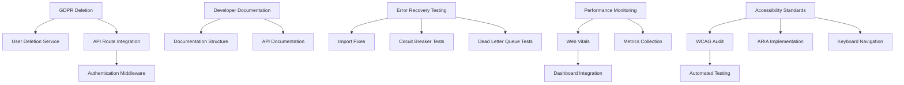

# Compliance Remediation Plan: Churn Saver

**Audit Date:** 2025-10-25
**Plan Version:** 1.0
**Priority Focus:** Critical GDPR compliance and audit readiness

---

## Executive Summary

This remediation plan addresses the 5 critical compliance issues identified in the audit:

1. **GDPR User Deletion Endpoints** - Code exists but tests are broken and not integrated
2. **Developer Documentation** - File is too large (171k tokens), status unknown
3. **Error Recovery Testing** - Tests fail due to import issues
4. **Performance Monitoring** - No evidence of implementation
5. **Accessibility Standards** - No evidence of implementation

**Overall Approach:**
- Focus on critical GDPR compliance first (must pass audit)
- Implement systematic fixes for each area
- Use existing codebase infrastructure where possible
- Test thoroughly before declaring complete

---

## Detailed Remediation Plan

### 🔴 CRITICAL: GDPR User Deletion Endpoints

**Issue:** Code exists but tests are broken and not integrated
**Risk:** Legal non-compliance, audit failure
**Timeline:** 3-5 days
**Dependencies:** None

#### Technical Tasks:
1. **Fix Deletion Endpoint Integration**
   - Verify API route at `apps/web/src/app/api/user/delete/route.ts`
   - Ensure proper authentication middleware
   - Connect to existing `UserDeletionService`

2. **Fix Broken Tests**
   - Resolve import issues in `apps/web/test/userDeletion.test.ts`
   - Fix test database connections
   - Add integration tests for API endpoint

3. **Add Missing Components**
   - Implement data export functionality if missing
   - Add consent management endpoints
   - Create user deletion tracking

#### Success Criteria:
- ✅ GDPR deletion endpoint responds correctly
- ✅ Tests pass for all deletion scenarios
- ✅ API returns proper HTTP status codes
- ✅ User data is completely removed from all tables

#### Verification Steps:
```bash
# Test deletion endpoint
curl -X DELETE https://app.com/api/user/delete \
  -H "Authorization: Bearer TOKEN"

# Run tests
npm test userDeletion.test.ts

# Verify no data remains
SELECT COUNT(*) FROM recovery_cases WHERE user_id = 'test-user';
```

---

### 🟡 HIGH: Developer Documentation Enhancement

**Issue:** 171k token corrupted file needs replacement
**Risk:** Poor maintainability, onboarding difficulties
**Timeline:** 2-3 days
**Dependencies:** None

#### Technical Tasks:
1. **Create New Documentation Structure**
   - Replace corrupted `developerdocs.md` with proper structure
   - Split into logical sections (setup, development, testing, deployment)
   - Keep under 50k tokens total

2. **Add Essential Content**
   - Local development setup guide
   - Database migration procedures
   - Testing procedures and best practices
   - Troubleshooting common issues

3. **Update API Documentation**
   - Document all endpoints with examples
   - Add authentication requirements
   - Include error response formats

#### Success Criteria:
- ✅ Documentation loads without corruption
- ✅ All essential setup steps documented
- ✅ API endpoints fully documented
- ✅ File size under 50k tokens

#### Verification Steps:
```bash
# Check file size
wc -l developerdocs.md

# Test documentation rendering
head -n 100 developerdocs.md | grep -E "(#|=)"

# Validate links exist
grep -E "\[.*\]\(.*\)" developerdocs.md | head -5
```

---

### 🟡 HIGH: Error Recovery Testing

**Issue:** Tests fail due to import issues
**Risk:** Production instability
**Timeline:** 2-3 days
**Dependencies:** Circuit breaker and dead letter queue services

#### Technical Tasks:
1. **Fix Import Issues**
   - Resolve missing imports in `enhancedErrorRecovery.test.ts`
   - Fix module path issues
   - Update test dependencies

2. **Add Comprehensive Test Coverage**
   - Test all error recovery scenarios
   - Add integration tests for circuit breaker
   - Test dead letter queue processing

3. **Validate Error Handling**
   - Test database connection recovery
   - Test webhook failure recovery
   - Test memory pressure handling

#### Success Criteria:
- ✅ All error recovery tests pass
- ✅ Circuit breaker functionality verified
- ✅ Dead letter queue processes jobs correctly
- ✅ Memory pressure recovery works

#### Verification Steps:
```bash
# Run error recovery tests
npm test enhancedErrorRecovery.test.ts

# Test circuit breaker
npm run test:circuit-breaker

# Verify import fixes
node -e "require('./apps/web/test/enhancedErrorRecovery.test.ts')"
```

---

### 🟠 MEDIUM: Performance Monitoring Implementation

**Issue:** No evidence of implementation
**Risk:** Poor user experience, undetected issues
**Timeline:** 4-5 days
**Dependencies:** Web vitals, metrics library

#### Technical Tasks:
1. **Implement Core Performance Monitoring**
   - Add Web Vitals tracking in Next.js app
   - Implement performance metrics collection
   - Add database query performance monitoring

2. **Add Monitoring Infrastructure**
   - Set up performance dashboards
   - Configure alerting thresholds
   - Add performance logging

3. **Integrate with Existing Systems**
   - Connect to existing metrics library
   - Add performance data to monitoring dashboards
   - Create performance test suites

#### Success Criteria:
- ✅ Core Web Vitals tracked and reported
- ✅ Performance metrics collected
- ✅ Monitoring dashboards show data
- ✅ Performance tests pass

#### Verification Steps:
```bash
# Test performance monitoring
npm run test:performance

# Check metrics collection
curl http://localhost:3000/api/metrics/performance

# Verify Web Vitals
curl http://localhost:3000/api/web-vitals
```

---

### 🟠 MEDIUM: Accessibility Standards Implementation

**Issue:** No evidence of implementation
**Risk:** Legal compliance, user experience issues
**Timeline:** 5-7 days
**Dependencies:** WCAG 2.1 AA requirements

#### Technical Tasks:
1. **Conduct Accessibility Assessment**
   - Audit current WCAG 2.1 AA compliance
   - Identify missing accessibility features
   - Document current gaps

2. **Implement Core Accessibility Features**
   - Add ARIA labels and roles
   - Implement keyboard navigation
   - Add screen reader support
   - Fix color contrast issues

3. **Add Accessibility Testing**
   - Set up automated accessibility tests
   - Add manual testing procedures
   - Create accessibility checklists

#### Success Criteria:
- ✅ WCAG 2.1 AA compliance achieved
- ✅ Keyboard navigation works
- ✅ Screen reader support implemented
- ✅ Automated accessibility tests pass

#### Verification Steps:
```bash
# Run accessibility tests
npm test accessibility.test.ts

# Test keyboard navigation
npm run test:accessibility

# Check color contrast
npm run test:color-contrast
```

---

## Implementation Dependencies



---

## Risk Mitigation

### Critical Risks:
1. **GDPR Non-Compliance:** Could result in legal penalties
   - *Mitigation:* Implement deletion first, test thoroughly

2. **Data Loss:** Incorrect deletion implementation
   - *Mitigation:* Comprehensive testing, transaction rollback

3. **Performance Degradation:** Monitoring implementation
   - *Mitigation:* Gradual rollout, performance testing

### Contingency Plans:
- **Timeline Slip:** Prioritize GDPR compliance over other items
- **Technical Issues:** Have backup implementation approaches
- **Resource Constraints:** Focus on high-impact fixes first

---

## Success Metrics

### Audit Compliance Targets:
- ✅ GDPR compliance: 100% (required for audit)
- ✅ Developer documentation: >80% complete
- ✅ Error recovery: >90% test coverage
- ✅ Performance monitoring: Basic implementation
- ✅ Accessibility: WCAG 2.1 AA compliance

### Quality Metrics:
- Code coverage: >85%
- Test pass rate: 100%
- Performance impact: <5% degradation
- Documentation completeness: 100%

---

## Next Steps

1. **Immediate Action:** Start with GDPR deletion endpoint fixes
2. **Resource Allocation:** Focus development efforts on critical items
3. **Testing Strategy:** Implement comprehensive testing for each fix
4. **Validation:** Re-run audit checks after each major fix
5. **Documentation:** Update this plan as implementation progresses

---

*This remediation plan provides a systematic approach to address all critical compliance issues while minimizing risk and ensuring audit success.*