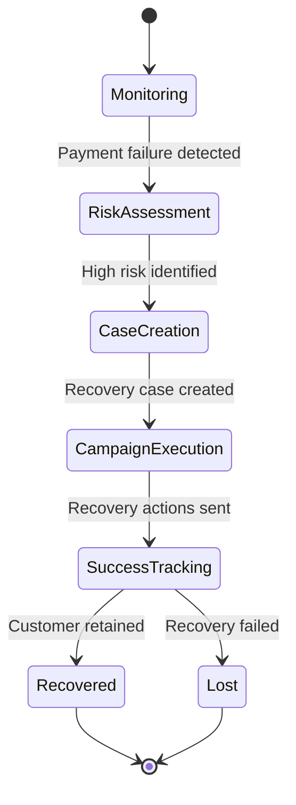

# Recovery System

The Churn Saver recovery system automatically identifies at-risk customers and implements targeted retention strategies to maximize customer lifetime value.

## Overview

### How It Works

1. **Event Monitoring**: System monitors payment events and customer behavior
2. **Risk Assessment**: AI-powered analysis determines churn probability
3. **Case Creation**: Automated case generation for high-risk customers
4. **Recovery Execution**: Multi-channel recovery campaigns with incentives
5. **Success Tracking**: Real-time monitoring and ROI measurement

### Recovery Flow



## Core Components

### 1. Case Management

#### Recovery Case Structure

```typescript
interface RecoveryCase {
  id: string;
  userId: string;
  status: 'pending' | 'active' | 'recovered' | 'lost';
  riskLevel: 'low' | 'medium' | 'high' | 'critical';
  triggerEvent: {
    type: 'payment_failed' | 'subscription_cancelled' | 'downgrade';
    timestamp: Date;
    amount?: number;
    reason?: string;
  };
  recoveryStrategy: {
    priority: number;
    channels: ('email' | 'sms' | 'push')[];
    incentives: Incentive[];
    timeline: RecoveryStep[];
  };
  metrics: {
    createdAt: Date;
    firstContactAt?: Date;
    recoveredAt?: Date;
    totalValue: number;
    incentiveCost: number;
  };
}
```

#### Case Lifecycle

**Pending → Active**
- Case created and validated
- Initial risk assessment completed
- Recovery strategy assigned

**Active → Recovered**
- Customer successfully retained
- Payment recovered or subscription reactivated
- Success metrics recorded

**Active → Lost**
- Recovery attempts exhausted
- Customer permanently churned
- Case archived for analysis

### 2. Risk Assessment Engine

#### Risk Factors

**Payment-Based Risk**:
- Failed payment attempts
- Subscription cancellation requests
- Payment method expiration
- Billing address changes

**Behavioral Risk**:
- Reduced feature usage
- Support ticket volume increase
- Login frequency decrease
- Feature downgrade requests

**Account Risk**:
- Account age and history
- Payment history reliability
- Customer lifetime value
- Support interaction patterns

#### Risk Scoring Algorithm

```typescript
function calculateRiskScore(customer: Customer): RiskLevel {
  const paymentRisk = calculatePaymentRisk(customer.paymentHistory);
  const behavioralRisk = calculateBehavioralRisk(customer.activity);
  const accountRisk = calculateAccountRisk(customer.profile);

  const totalScore = (paymentRisk * 0.5) + (behavioralRisk * 0.3) + (accountRisk * 0.2);

  if (totalScore >= 0.8) return 'critical';
  if (totalScore >= 0.6) return 'high';
  if (totalScore >= 0.4) return 'medium';
  return 'low';
}
```

### 3. Recovery Strategies

#### Strategy Selection

**Critical Risk (80-100%)**:
- Immediate phone outreach
- High-value incentives (50%+ discount)
- Executive-level communication
- Account hold with payment extension

**High Risk (60-79%)**:
- Personalized email sequence
- Moderate incentives (20-40% discount)
- SMS follow-up reminders
- Feature comparison highlighting

**Medium Risk (40-59%)**:
- Automated email campaigns
- Low-value incentives (10-20% discount)
- Educational content about value
- Survey for feedback collection

**Low Risk (0-39%)**:
- Nurture campaigns
- Minor incentives (free trial extension)
- Usage tips and best practices
- Proactive value communication

### 4. Communication Channels

#### Email Campaigns

**Sequence Timing**:
- Email 1: Immediate (within 1 hour)
- Email 2: 24 hours after first email
- Email 3: 72 hours after first email
- Email 4: 7 days after first email (final attempt)

**Personalization**:
- Customer name and company details
- Specific cancellation reasons addressed
- Tailored incentives based on usage
- Dynamic content based on customer segment

#### SMS Notifications

**Use Cases**:
- Payment failure alerts
- Urgent recovery attempts
- Appointment confirmations
- Status updates

**Best Practices**:
- Keep under 160 characters
- Include clear call-to-action
- Personalize with customer name
- Respect opt-in preferences

#### Push Notifications

**Mobile App Integration**:
- In-app recovery offers
- Usage reminders
- Success confirmations
- Re-engagement prompts

### 5. Incentive Management

#### Incentive Types

**Discount Incentives**:
```typescript
interface DiscountIncentive {
  type: 'percentage' | 'fixed_amount';
  value: number; // percentage (0-100) or dollar amount
  duration: 'one_time' | 'months' | 'forever';
  applicableTo: 'current_invoice' | 'next_billing' | 'future_purchases';
}
```

**Credit Incentives**:
```typescript
interface CreditIncentive {
  type: 'account_credit' | 'service_credit';
  amount: number;
  expiresIn: number; // days
  restrictions: string[]; // usage restrictions
}
```

**Feature Incentives**:
```typescript
interface FeatureIncentive {
  type: 'feature_unlock' | 'upgrade_trial';
  features: string[];
  duration: number; // days
  autoExpire: boolean;
}
```

#### Budget Management

**Incentive Budgeting**:
- Monthly budget allocation
- Cost per acquisition limits
- ROI-based optimization
- Customer lifetime value weighting

**Tracking and Analytics**:
- Incentive redemption rates
- Cost per recovery
- Revenue impact measurement
- A/B testing of incentive effectiveness

## Success Metrics

### Key Performance Indicators

**Recovery Rate**:
```
Recovery Rate = (Recovered Customers ÷ Total Recovery Cases) × 100
```

**Revenue Recovery**:
```
Revenue Recovery = Σ(Recovered Customer Revenue) - Σ(Incentive Costs)
```

**Time to Recovery**:
```
Time to Recovery = Average(Recovery Date - Trigger Date)
```

**Cost per Recovery**:
```
Cost per Recovery = Total Incentive Costs ÷ Number of Recoveries
```

### Success Factors

**Fast Response Time**:
- Critical risk cases: Response within 1 hour
- High risk cases: Response within 4 hours
- Medium risk cases: Response within 24 hours

**Personalization**:
- Use customer data for targeted messaging
- Address specific cancellation reasons
- Offer relevant incentives based on usage patterns

**Multi-Channel Approach**:
- Combine email, SMS, and phone outreach
- Escalate communication based on engagement
- Respect customer communication preferences

## Implementation Details

### Case Creation Triggers

#### Payment Events

**Payment Failed**:
```typescript
// Trigger: payment.failed webhook
if (payment.status === 'failed' && payment.attemptCount >= 2) {
  createRecoveryCase({
    userId: payment.customerId,
    triggerType: 'payment_failed',
    riskLevel: calculatePaymentRisk(payment),
    amount: payment.amount
  });
}
```

**Subscription Cancelled**:
```typescript
// Trigger: subscription.cancelled webhook
if (subscription.cancelledAt && !subscription.willRenew) {
  createRecoveryCase({
    userId: subscription.customerId,
    triggerType: 'subscription_cancelled',
    riskLevel: 'high',
    reason: subscription.cancellationReason
  });
}
```

#### Usage-Based Triggers

**Feature Downgrade**:
```typescript
// Trigger: plan changed to lower tier
if (newPlan.tier < currentPlan.tier) {
  createRecoveryCase({
    userId: customer.id,
    triggerType: 'downgrade',
    riskLevel: 'medium',
    reason: 'plan_downgrade'
  });
}
```

### Recovery Workflow Automation

#### Email Sequence Automation

```typescript
async function executeRecoverySequence(caseId: string) {
  const recoveryCase = await getRecoveryCase(caseId);

  // Email 1: Immediate win-back offer
  await sendRecoveryEmail(recoveryCase, 'immediate_offer');

  // Wait 24 hours, check for recovery
  await delay(24 * 60 * 60 * 1000);
  if (await checkRecoveryStatus(caseId)) return;

  // Email 2: Value proposition reminder
  await sendRecoveryEmail(recoveryCase, 'value_reminder');

  // Continue sequence based on engagement
}
```

#### Success Detection

```typescript
async function checkRecoveryStatus(caseId: string): Promise<boolean> {
  const recoveryCase = await getRecoveryCase(caseId);

  // Check for successful payment
  const recentPayments = await getPaymentsSince(
    recoveryCase.userId,
    recoveryCase.createdAt
  );

  // Check for subscription reactivation
  const subscription = await getCurrentSubscription(recoveryCase.userId);

  return recentPayments.some(p => p.status === 'succeeded') ||
         (subscription && subscription.willRenew);
}
```

## Best Practices

### Customer Experience

**Empathy and Understanding**:
- Acknowledge customer frustrations
- Take responsibility for issues
- Show genuine concern for their business

**Clear Communication**:
- Explain what happened and why
- Be transparent about next steps
- Set realistic expectations

**Easy Resolution Paths**:
- One-click recovery options
- Clear instructions for next steps
- Multiple contact channels

### Technical Best Practices

**Event-Driven Architecture**:
- Async processing for scalability
- Idempotent operations for reliability
- Circuit breakers for external dependencies

**Data Quality**:
- Validate all input data
- Implement data consistency checks
- Regular data cleanup procedures

**Monitoring and Alerting**:
- Track recovery success rates
- Monitor system performance
- Alert on SLA violations

## Troubleshooting

### Common Issues

**Cases Not Created**:
- Check webhook configuration
- Verify event processing logs
- Validate risk assessment logic

**Emails Not Sending**:
- Check SMTP configuration
- Verify email templates
- Monitor delivery rates

**Incentives Not Applied**:
- Validate incentive eligibility
- Check budget constraints
- Review application logic

### Performance Optimization

**Database Optimization**:
- Index frequently queried columns
- Implement query result caching
- Use database connection pooling

**Caching Strategy**:
- Cache customer profile data
- Cache incentive configurations
- Cache email templates

**Queue Management**:
- Implement priority queues for critical cases
- Monitor queue depth and processing rates
- Set up dead letter queues for failed messages

## Next Steps

- **[Incentive Management](incentives.md)** - Detailed incentive configuration
- **[Dashboard & Analytics](dashboard.md)** - Monitoring and reporting
- **[API Integration](../api/webhooks.md)** - Webhook configuration
- **[Testing Scenarios](../testing/integration.md)** - Recovery system testing