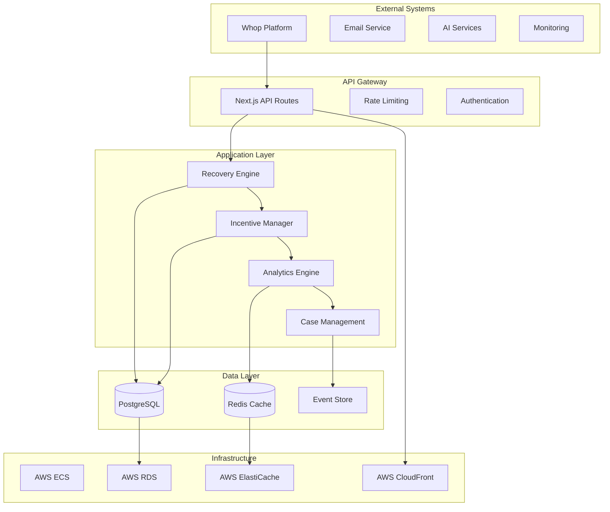

# System Architecture

This guide provides a comprehensive overview of Churn Saver's system architecture, including core components, data flow, security measures, and scaling considerations.

## High-Level Architecture



## Core Components

### 1. API Gateway Layer

#### Next.js API Routes

The API gateway handles all external communications:

```typescript
// pages/api/cases/[id].ts - Case management endpoint
export default async function handler(req: NextApiRequest, res: NextApiResponse) {
  // Authentication middleware
  await authenticateRequest(req);

  // Rate limiting
  await checkRateLimit(req);

  // Route to appropriate handler
  switch (req.method) {
    case 'GET':
      return await getCaseHandler(req, res);
    case 'PATCH':
      return await updateCaseHandler(req, res);
    default:
      res.setHeader('Allow', ['GET', 'PATCH']);
      res.status(405).end(`Method ${req.method} Not Allowed`);
  }
}
```

**Key Features**:
- **Request Validation**: Input sanitization and schema validation
- **Authentication**: JWT token verification and session management
- **Rate Limiting**: Configurable limits per endpoint and user
- **CORS Handling**: Cross-origin request management
- **Error Handling**: Standardized error responses

#### Middleware Stack

```typescript
// lib/middleware/index.ts
export const middleware = [
  corsMiddleware,
  securityHeadersMiddleware,
  authenticationMiddleware,
  rateLimitMiddleware,
  loggingMiddleware,
  errorHandlingMiddleware
];

export async function applyMiddleware(req: NextApiRequest, res: NextApiResponse) {
  for (const middleware of middleware) {
    const result = await middleware(req, res);
    if (result === false) return; // Stop processing
  }
}
```

### 2. Application Layer

#### Recovery Engine

The core intelligence behind customer retention:

```typescript
// lib/recovery/engine.ts
class RecoveryEngine {
  async assessRisk(customerId: string): Promise<RiskAssessment> {
    // Gather customer data
    const customerData = await this.gatherCustomerData(customerId);

    // Apply risk scoring algorithms
    const paymentRisk = await this.assessPaymentRisk(customerData);
    const usageRisk = await this.assessUsageRisk(customerData);
    const engagementRisk = await this.assessEngagementRisk(customerData);

    // Calculate overall risk score
    const overallRisk = this.calculateOverallRisk({
      paymentRisk,
      usageRisk,
      engagementRisk
    });

    return {
      customerId,
      riskScore: overallRisk.score,
      riskLevel: overallRisk.level,
      factors: overallRisk.factors,
      confidence: overallRisk.confidence,
      timestamp: new Date()
    };
  }

  async createRecoveryCase(riskAssessment: RiskAssessment): Promise<RecoveryCase> {
    // Determine recovery strategy
    const strategy = await this.selectRecoveryStrategy(riskAssessment);

    // Create case record
    const recoveryCase = await database.recoveryCases.create({
      customerId: riskAssessment.customerId,
      riskLevel: riskAssessment.riskLevel,
      strategy: strategy,
      status: 'active',
      createdAt: new Date()
    });

    // Initiate recovery workflow
    await this.initiateRecoveryWorkflow(recoveryCase);

    return recoveryCase;
  }
}
```

**Risk Assessment Components**:

1. **Payment Risk**: Failed payments, declined cards, subscription issues
2. **Usage Risk**: Reduced feature usage, login frequency decline
3. **Engagement Risk**: Support ticket increases, feature requests decrease
4. **Account Risk**: Account age, plan type, historical behavior

#### Incentive Manager

Handles all customer incentives and promotions:

```typescript
// lib/incentives/manager.ts
class IncentiveManager {
  async applyIncentive(caseId: string, incentiveType: string): Promise<IncentiveResult> {
    // Validate incentive eligibility
    const eligibility = await this.checkEligibility(caseId, incentiveType);

    if (!eligibility.eligible) {
      throw new Error(`Incentive not eligible: ${eligibility.reason}`);
    }

    // Check budget constraints
    const budgetCheck = await this.checkBudget(incentiveType);

    if (!budgetCheck.available) {
      throw new Error('Budget exceeded for incentive type');
    }

    // Apply the incentive
    const incentive = await this.createIncentive({
      caseId,
      type: incentiveType,
      value: this.calculateIncentiveValue(caseId, incentiveType),
      expiresAt: this.calculateExpiration(caseId, incentiveType)
    });

    // Update budget tracking
    await this.updateBudget(incentiveType, incentive.value);

    // Notify relevant systems
    await this.notifyIncentiveApplied(incentive);

    return {
      success: true,
      incentiveId: incentive.id,
      appliedAt: incentive.appliedAt,
      expiresAt: incentive.expiresAt
    };
  }

  async trackIncentiveRedemption(incentiveId: string): Promise<void> {
    // Update incentive status
    await database.incentives.update(incentiveId, {
      redeemedAt: new Date(),
      status: 'redeemed'
    });

    // Calculate ROI
    const roi = await this.calculateIncentiveROI(incentiveId);

    // Update analytics
    await analytics.trackIncentiveROI(incentiveId, roi);

    // Trigger post-redemption actions
    await this.handlePostRedemption(incentiveId);
  }
}
```

#### Case Management System

Manages the complete lifecycle of recovery cases:

```typescript
// lib/cases/manager.ts
class CaseManager {
  async createCase(caseData: CaseCreationData): Promise<RecoveryCase> {
    // Validate case data
    this.validateCaseData(caseData);

    // Create case record
    const recoveryCase = await database.recoveryCases.create({
      ...caseData,
      status: 'active',
      priority: this.calculatePriority(caseData),
      createdAt: new Date(),
      updatedAt: new Date()
    });

    // Set up case timeline
    await this.initializeCaseTimeline(recoveryCase.id);

    // Assign to appropriate queue
    await this.assignToQueue(recoveryCase);

    // Notify stakeholders
    await this.notifyCaseCreation(recoveryCase);

    return recoveryCase;
  }

  async updateCaseStatus(caseId: string, status: CaseStatus, metadata?: any): Promise<void> {
    // Validate status transition
    const currentCase = await this.getCase(caseId);
    this.validateStatusTransition(currentCase.status, status);

    // Update case
    await database.recoveryCases.update(caseId, {
      status,
      updatedAt: new Date(),
      metadata: { ...currentCase.metadata, ...metadata }
    });

    // Add timeline entry
    await this.addTimelineEntry(caseId, 'status_changed', {
      from: currentCase.status,
      to: status,
      metadata
    });

    // Trigger status-specific actions
    await this.handleStatusChange(caseId, status, metadata);
  }

  async escalateCase(caseId: string, reason: string): Promise<void> {
    const recoveryCase = await this.getCase(caseId);

    // Update priority
    const newPriority = this.calculateEscalatedPriority(recoveryCase.priority);

    await database.recoveryCases.update(caseId, {
      priority: newPriority,
      escalatedAt: new Date(),
      escalationReason: reason
    });

    // Notify escalation team
    await notificationService.notifyEscalation({
      caseId,
      priority: newPriority,
      reason,
      case: recoveryCase
    });

    // Add to escalation queue
    await queueService.addToQueue('escalation', {
      caseId,
      priority: newPriority,
      reason
    });
  }
}
```

### 3. Data Layer

#### Database Schema

**Core Tables**:

```sql
-- Recovery cases
CREATE TABLE recovery_cases (
  id UUID PRIMARY KEY DEFAULT gen_random_uuid(),
  customer_id VARCHAR(255) NOT NULL,
  status VARCHAR(50) NOT NULL DEFAULT 'active',
  risk_level VARCHAR(20) NOT NULL,
  priority INTEGER DEFAULT 1,
  strategy JSONB,
  metadata JSONB,
  created_at TIMESTAMP WITH TIME ZONE DEFAULT NOW(),
  updated_at TIMESTAMP WITH TIME ZONE DEFAULT NOW(),
  escalated_at TIMESTAMP WITH TIME ZONE,
  resolved_at TIMESTAMP WITH TIME ZONE
);

-- Incentives
CREATE TABLE incentives (
  id UUID PRIMARY KEY DEFAULT gen_random_uuid(),
  case_id UUID REFERENCES recovery_cases(id),
  customer_id VARCHAR(255) NOT NULL,
  type VARCHAR(50) NOT NULL,
  config JSONB NOT NULL,
  value DECIMAL(10,2),
  status VARCHAR(20) DEFAULT 'active',
  applied_at TIMESTAMP WITH TIME ZONE,
  redeemed_at TIMESTAMP WITH TIME ZONE,
  expires_at TIMESTAMP WITH TIME ZONE,
  created_at TIMESTAMP WITH TIME ZONE DEFAULT NOW()
);

-- Events and analytics
CREATE TABLE events (
  id UUID PRIMARY KEY DEFAULT gen_random_uuid(),
  type VARCHAR(100) NOT NULL,
  customer_id VARCHAR(255),
  case_id UUID REFERENCES recovery_cases(id),
  data JSONB,
  timestamp TIMESTAMP WITH TIME ZONE DEFAULT NOW(),
  processed BOOLEAN DEFAULT FALSE
);

-- Audit log
CREATE TABLE audit_log (
  id UUID PRIMARY KEY DEFAULT gen_random_uuid(),
  user_id VARCHAR(255),
  action VARCHAR(100) NOT NULL,
  resource VARCHAR(255),
  resource_id VARCHAR(255),
  changes JSONB,
  ip_address INET,
  user_agent TEXT,
  timestamp TIMESTAMP WITH TIME ZONE DEFAULT NOW()
);
```

#### Caching Strategy

**Redis Cache Layers**:

```typescript
// lib/cache/index.ts
class CacheManager {
  private redis = new Redis(process.env.REDIS_URL);

  // Session data cache (short-term)
  async getSession(sessionId: string): Promise<Session | null> {
    const key = `session:${sessionId}`;
    const data = await this.redis.get(key);
    return data ? JSON.parse(data) : null;
  }

  async setSession(sessionId: string, session: Session, ttl = 3600): Promise<void> {
    const key = `session:${sessionId}`;
    await this.redis.setex(key, ttl, JSON.stringify(session));
  }

  // Customer data cache (medium-term)
  async getCustomerProfile(customerId: string): Promise<CustomerProfile | null> {
    const key = `customer:${customerId}:profile`;
    const data = await this.redis.get(key);

    if (data) {
      // Extend TTL on access
      await this.redis.expire(key, 1800); // 30 minutes
      return JSON.parse(data);
    }

    return null;
  }

  async setCustomerProfile(customerId: string, profile: CustomerProfile): Promise<void> {
    const key = `customer:${customerId}:profile`;
    await this.redis.setex(key, 1800, JSON.stringify(profile)); // 30 minutes
  }

  // Analytics cache (long-term)
  async getAnalyticsData(query: AnalyticsQuery): Promise<AnalyticsData | null> {
    const key = `analytics:${this.hashQuery(query)}`;
    const data = await this.redis.get(key);
    return data ? JSON.parse(data) : null;
  }

  async setAnalyticsData(query: AnalyticsQuery, data: AnalyticsData): Promise<void> {
    const key = `analytics:${this.hashQuery(query)}`;
    await this.redis.setex(key, 3600, JSON.stringify(data)); // 1 hour
  }

  // Cache invalidation
  async invalidateCustomerCache(customerId: string): Promise<void> {
    const keys = await this.redis.keys(`customer:${customerId}:*`);
    if (keys.length > 0) {
      await this.redis.del(...keys);
    }
  }

  async invalidateCaseCache(caseId: string): Promise<void> {
    const keys = await this.redis.keys(`case:${caseId}:*`);
    if (keys.length > 0) {
      await this.redis.del(...keys);
    }
  }
}
```

### 4. Event Processing

#### Event-Driven Architecture

```typescript
// lib/events/processor.ts
class EventProcessor {
  private eventHandlers = new Map<string, EventHandler>();

  registerHandler(eventType: string, handler: EventHandler): void {
    this.eventHandlers.set(eventType, handler);
  }

  async processEvent(event: SystemEvent): Promise<void> {
    // Store event for audit and replay
    await this.storeEvent(event);

    // Find and execute handler
    const handler = this.eventHandlers.get(event.type);

    if (handler) {
      try {
        await handler.process(event);
        await this.markEventProcessed(event.id);
      } catch (error) {
        await this.handleProcessingError(event, error);
      }
    } else {
      console.warn(`No handler found for event type: ${event.type}`);
    }
  }

  private async storeEvent(event: SystemEvent): Promise<void> {
    await database.events.create({
      type: event.type,
      customer_id: event.customerId,
      data: event.data,
      timestamp: event.timestamp,
      processed: false
    });
  }

  private async markEventProcessed(eventId: string): Promise<void> {
    await database.events.update(eventId, {
      processed: true,
      processed_at: new Date()
    });
  }

  private async handleProcessingError(event: SystemEvent, error: Error): Promise<void> {
    // Log error
    await logger.error('Event processing failed', {
      eventId: event.id,
      eventType: event.type,
      error: error.message,
      stack: error.stack
    });

    // Mark for retry or dead letter queue
    const retryCount = (event.metadata?.retryCount || 0) + 1;

    if (retryCount < 3) {
      // Schedule retry
      await queueService.scheduleRetry(event, retryCount);
    } else {
      // Move to dead letter queue
      await deadLetterQueue.add(event);
    }
  }
}

// Usage
const processor = new EventProcessor();

// Register event handlers
processor.registerHandler('payment.failed', new PaymentFailedHandler());
processor.registerHandler('case.created', new CaseCreatedHandler());
processor.registerHandler('incentive.applied', new IncentiveAppliedHandler());

// Process incoming events
await processor.processEvent({
  id: 'evt_123',
  type: 'payment.failed',
  customerId: 'user_456',
  data: { amount: 29.99, reason: 'insufficient_funds' },
  timestamp: new Date()
});
```

### 5. Security Architecture

#### Authentication & Authorization

```typescript
// lib/auth/index.ts
class AuthManager {
  async authenticate(token: string): Promise<User> {
    try {
      // Verify JWT token
      const payload = jwt.verify(token, process.env.JWT_SECRET!);

      // Check token in database (for revocation)
      const tokenRecord = await database.tokens.findById(payload.jti);

      if (!tokenRecord || tokenRecord.revoked) {
        throw new Error('Token revoked');
      }

      // Get user
      const user = await database.users.findById(payload.sub);

      if (!user || !user.active) {
        throw new Error('User not found or inactive');
      }

      return user;
    } catch (error) {
      throw new AuthenticationError('Invalid token', error);
    }
  }

  async authorize(user: User, resource: string, action: string): Promise<boolean> {
    // Check user's role permissions
    const rolePermissions = await this.getRolePermissions(user.role);

    // Check if user has the required permission
    const hasPermission = rolePermissions.some(permission =>
      permission.resource === resource && permission.action === action
    );

    if (!hasPermission) {
      return false;
    }

    // Additional context-based checks
    return await this.checkContextualPermissions(user, resource, action);
  }

  private async checkContextualPermissions(user: User, resource: string, action: string): Promise<boolean> {
    // Resource ownership checks
    if (resource.startsWith('case:') && action !== 'create') {
      const caseId = resource.split(':')[1];
      const caseData = await database.cases.findById(caseId);

      // Users can only access cases they own or are assigned to
      if (caseData.customerId !== user.id && caseData.assignedTo !== user.id) {
        // Check if user has admin privileges
        if (!user.roles.includes('admin')) {
          return false;
        }
      }
    }

    return true;
  }
}
```

#### Data Encryption

```typescript
// lib/security/encryption.ts
class DataEncryption {
  private algorithm = 'aes-256-gcm';
  private keyLength = 32;

  async encrypt(plaintext: string, context?: string): Promise<EncryptedData> {
    // Generate a unique encryption key for this data
    const dataKey = await this.generateDataKey();

    // Encrypt the data key with master key
    const encryptedKey = await this.encryptKey(dataKey);

    // Encrypt the data
    const iv = crypto.randomBytes(16);
    const cipher = crypto.createCipher(this.algorithm, dataKey);

    // Add context for additional security
    if (context) {
      cipher.setAAD(Buffer.from(context));
    }

    let encrypted = cipher.update(plaintext, 'utf8', 'hex');
    encrypted += cipher.final('hex');

    const authTag = cipher.getAuthTag();

    return {
      encrypted,
      key: encryptedKey,
      iv: iv.toString('hex'),
      authTag: authTag.toString('hex'),
      context
    };
  }

  async decrypt(encryptedData: EncryptedData): Promise<string> {
    // Decrypt the data key
    const dataKey = await this.decryptKey(encryptedData.key);

    // Decrypt the data
    const decipher = crypto.createDecipher(this.algorithm, dataKey);
    decipher.setAuthTag(Buffer.from(encryptedData.authTag, 'hex'));

    if (encryptedData.context) {
      decipher.setAAD(Buffer.from(encryptedData.context));
    }

    let decrypted = decipher.update(encryptedData.encrypted, 'hex', 'utf8');
    decrypted += decipher.final('utf8');

    return decrypted;
  }

  private async generateDataKey(): Promise<Buffer> {
    // Use AWS KMS or similar for key generation in production
    return crypto.randomBytes(this.keyLength);
  }

  private async encryptKey(dataKey: Buffer): Promise<string> {
    // Encrypt data key with master key (KMS in production)
    const masterKey = Buffer.from(process.env.MASTER_ENCRYPTION_KEY!, 'hex');
    const cipher = crypto.createCipher('aes-256-ecb', masterKey);
    let encrypted = cipher.update(dataKey);
    encrypted = Buffer.concat([encrypted, cipher.final()]);
    return encrypted.toString('hex');
  }

  private async decryptKey(encryptedKey: string): Promise<Buffer> {
    // Decrypt data key with master key
    const masterKey = Buffer.from(process.env.MASTER_ENCRYPTION_KEY!, 'hex');
    const decipher = crypto.createDecipher('aes-256-ecb', masterKey);
    let decrypted = decipher.update(Buffer.from(encryptedKey, 'hex'));
    decrypted = Buffer.concat([decrypted, decipher.final()]);
    return decrypted;
  }
}
```

## Scalability Considerations

### Horizontal Scaling

#### Application Layer Scaling

```typescript
// lib/scaling/load-balancer.ts
class LoadBalancer {
  private workers: Worker[] = [];
  private currentIndex = 0;

  addWorker(worker: Worker): void {
    this.workers.push(worker);
  }

  getNextWorker(): Worker {
    // Round-robin load balancing
    const worker = this.workers[this.currentIndex];
    this.currentIndex = (this.currentIndex + 1) % this.workers.length;
    return worker;
  }

  // Health check workers
  async healthCheck(): Promise<void> {
    const healthChecks = this.workers.map(async (worker) => {
      try {
        await worker.ping();
        worker.healthy = true;
      } catch (error) {
        worker.healthy = false;
        console.error(`Worker ${worker.id} is unhealthy:`, error);
      }
    });

    await Promise.all(healthChecks);

    // Remove unhealthy workers
    this.workers = this.workers.filter(w => w.healthy);
  }
}
```

#### Database Scaling

```sql
-- Read replicas for scaling reads
-- In production, use RDS read replicas or similar

-- Partitioning strategy for large tables
CREATE TABLE recovery_cases_y2025 PARTITION OF recovery_cases
    FOR VALUES FROM ('2025-01-01') TO ('2026-01-01')
    PARTITION BY RANGE (created_at);

-- Sharding key for distributed databases
-- customer_id can be used as sharding key for better data locality
CREATE INDEX idx_recovery_cases_customer_shard
    ON recovery_cases (customer_id, created_at DESC);
```

#### Caching for Performance

```typescript
// lib/scaling/cache-cluster.ts
class CacheCluster {
  private primary: Redis;
  private replicas: Redis[] = [];

  async get(key: string): Promise<string | null> {
    // Try primary first
    try {
      return await this.primary.get(key);
    } catch (error) {
      // Fallback to replica
      for (const replica of this.replicas) {
        try {
          return await replica.get(key);
        } catch (replicaError) {
          continue;
        }
      }
      return null;
    }
  }

  async set(key: string, value: string, ttl?: number): Promise<void> {
    // Write to primary
    await this.primary.set(key, value, ttl);

    // Asynchronously replicate to replicas
    this.replicas.forEach(replica => {
      replica.set(key, value, ttl).catch(error => {
        console.error('Replica write failed:', error);
      });
    });
  }

  // Cache warming for frequently accessed data
  async warmCache(): Promise<void> {
    const frequentlyAccessedKeys = await this.getFrequentlyAccessedKeys();

    for (const key of frequentlyAccessedKeys) {
      // Preload data into cache
      const data = await this.loadDataForKey(key);
      await this.set(key, data, 3600); // 1 hour TTL
    }
  }
}
```

## Monitoring & Observability

### Application Metrics

```typescript
// lib/monitoring/metrics.ts
class MetricsCollector {
  private metrics = {
    // HTTP metrics
    httpRequestsTotal: new Counter({
      name: 'http_requests_total',
      help: 'Total number of HTTP requests',
      labelNames: ['method', 'endpoint', 'status']
    }),

    httpRequestDuration: new Histogram({
      name: 'http_request_duration_seconds',
      help: 'Duration of HTTP requests',
      labelNames: ['method', 'endpoint'],
      buckets: [0.1, 0.5, 1, 2.5, 5, 10]
    }),

    // Business metrics
    recoveryCasesCreated: new Counter({
      name: 'recovery_cases_created_total',
      help: 'Total number of recovery cases created',
      labelNames: ['risk_level']
    }),

    incentivesApplied: new Counter({
      name: 'incentives_applied_total',
      help: 'Total number of incentives applied',
      labelNames: ['type', 'status']
    }),

    // System metrics
    activeConnections: new Gauge({
      name: 'active_connections',
      help: 'Number of active connections'
    }),

    databaseConnections: new Gauge({
      name: 'database_connections_active',
      help: 'Number of active database connections'
    })
  };

  recordHttpRequest(method: string, endpoint: string, status: number, duration: number): void {
    this.metrics.httpRequestsTotal.inc({ method, endpoint, status: status.toString() });
    this.metrics.httpRequestDuration.observe({ method, endpoint }, duration);
  }

  recordRecoveryCaseCreated(riskLevel: string): void {
    this.metrics.recoveryCasesCreated.inc({ risk_level: riskLevel });
  }

  recordIncentiveApplied(type: string, status: string): void {
    this.metrics.incentivesApplied.inc({ type, status });
  }

  updateActiveConnections(count: number): void {
    this.metrics.activeConnections.set(count);
  }

  updateDatabaseConnections(count: number): void {
    this.metrics.databaseConnections.set(count);
  }
}
```

### Error Tracking & Alerting

```typescript
// lib/monitoring/error-tracking.ts
class ErrorTracker {
  async trackError(error: Error, context?: any): Promise<void> {
    // Log to console/file
    console.error('Error occurred:', error, context);

    // Send to error tracking service (Sentry, Bugsnag, etc.)
    if (process.env.SENTRY_DSN) {
      Sentry.captureException(error, {
        contexts: {
          runtime: context
        }
      });
    }

    // Check if this is an alert-worthy error
    if (this.isAlertWorthy(error)) {
      await this.sendAlert(error, context);
    }

    // Store in database for analysis
    await database.errors.create({
      message: error.message,
      stack: error.stack,
      context: JSON.stringify(context),
      timestamp: new Date(),
      severity: this.calculateSeverity(error)
    });
  }

  private isAlertWorthy(error: Error): boolean {
    // Critical system errors
    if (error.message.includes('database connection failed')) return true;
    if (error.message.includes('redis connection failed')) return true;

    // Authentication failures (brute force detection)
    if (error.message.includes('invalid credentials')) return true;

    // Data integrity issues
    if (error.message.includes('constraint violation')) return true;

    return false;
  }

  private async sendAlert(error: Error, context?: any): Promise<void> {
    const alert = {
      title: 'System Error Alert',
      message: error.message,
      severity: this.calculateSeverity(error),
      context: context,
      timestamp: new Date()
    };

    // Send to multiple channels
    await Promise.all([
      slackNotifier.sendAlert(alert),
      emailNotifier.sendAlert(alert),
      pagerDutyNotifier.sendAlert(alert)
    ]);
  }

  private calculateSeverity(error: Error): 'low' | 'medium' | 'high' | 'critical' {
    if (error.message.includes('database') || error.message.includes('connection')) {
      return 'critical';
    }
    if (error.message.includes('authentication') || error.message.includes('security')) {
      return 'high';
    }
    if (error.message.includes('validation')) {
      return 'medium';
    }
    return 'low';
  }
}
```

## Deployment Architecture

### Multi-Environment Setup

```typescript
// lib/config/environments.ts
const environments = {
  development: {
    database: {
      host: 'localhost',
      port: 5432,
      database: 'churn_saver_dev'
    },
    redis: {
      host: 'localhost',
      port: 6379
    },
    monitoring: {
      enabled: false
    },
    security: {
      jwtExpiry: '24h',
      rateLimit: 1000
    }
  },

  staging: {
    database: {
      host: process.env.DB_HOST!,
      port: 5432,
      database: 'churn_saver_staging'
    },
    redis: {
      host: process.env.REDIS_HOST!,
      port: 6379,
      password: process.env.REDIS_PASSWORD
    },
    monitoring: {
      enabled: true,
      sentry: { dsn: process.env.SENTRY_DSN! },
      datadog: { apiKey: process.env.DATADOG_API_KEY! }
    },
    security: {
      jwtExpiry: '12h',
      rateLimit: 5000
    }
  },

  production: {
    database: {
      host: process.env.DB_HOST!,
      port: 5432,
      database: 'churn_saver_prod',
      ssl: true,
      maxConnections: 50
    },
    redis: {
      host: process.env.REDIS_HOST!,
      port: 6379,
      password: process.env.REDIS_PASSWORD,
      cluster: true
    },
    monitoring: {
      enabled: true,
      sentry: { dsn: process.env.SENTRY_DSN! },
      datadog: { apiKey: process.env.DATADOG_API_KEY! },
      alerts: true
    },
    security: {
      jwtExpiry: '1h',
      rateLimit: 10000,
      encryption: 'aes-256-gcm'
    }
  }
};
```

## Next Steps

### Architecture Evolution

1. **Microservices Migration**: Break down monolithic components into independent services
2. **Event Sourcing**: Implement complete event sourcing for better auditability
3. **CQRS Pattern**: Separate read and write models for better performance
4. **Multi-Region Deployment**: Global distribution for better performance and compliance

### Recommended Reading

- [Clean Architecture](https://blog.cleancoder.com/uncle-bob/2012/08/13/the-clean-architecture.html) by Robert C. Martin
- [Domain-Driven Design](https://domainlanguage.com/ddd/) by Eric Evans
- [Building Microservices](https://samnewman.io/books/building_microservices/) by Sam Newman
- [Designing Data-Intensive Applications](https://dataintensive.net/) by Martin Kleppmann

### Further Exploration

- **[Setup Guide](setup.md)**: Get started with local development
- **[API Reference](../api/rest-api.md)**: Complete API documentation
- **[Security Overview](../security/overview.md)**: Security architecture and compliance
- **[Deployment Guide](../deployment/production.md)**: Production deployment procedures