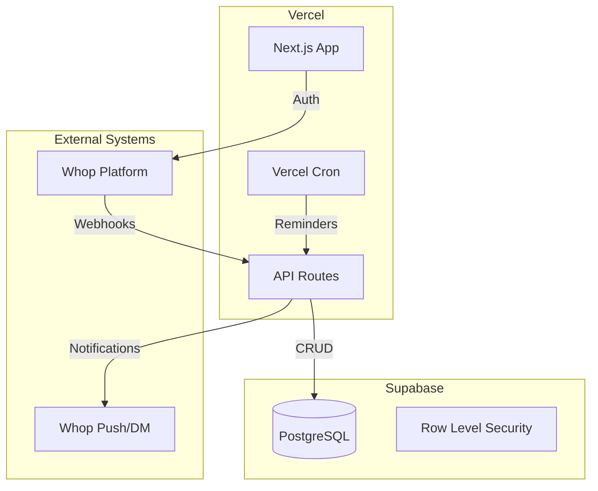

# System Architecture

This guide provides an overview of Churn Saver's system architecture on Vercel + Supabase.

## High-Level Architecture


```mermaid
graph TB
    subgraph "External Systems"
        A[Whop Platform]
        B[Whop Push/DM]
    end

    subgraph "Vercel"
        C[Next.js App]
        D[API Routes]
        E[Vercel Cron]
    end

    subgraph "Supabase"
        F[(PostgreSQL)]
        G[Row Level Security]
    end

    A -->|Webhooks| D
    D -->|CRUD| F
    E -->|Reminders| D
    D -->|Notifications| B
    C -->|Auth| A
```

## Infrastructure

| Component | Service | Purpose |
|-----------|---------|---------|
| Frontend | Vercel | Next.js hosting, edge network |
| API | Vercel Functions | Serverless API routes |
| Database | Supabase | PostgreSQL with RLS |
| Cron | Vercel Cron | Scheduled reminder jobs |
| Auth | Whop SDK | User authentication via Whop |
| Notifications | Whop API | Push notifications and DMs |

## Core Components

### 1. API Routes

All API endpoints are Next.js API routes deployed as Vercel Functions:

- `POST /api/lean/webhooks/whop` - Webhook ingestion
- `GET /api/cron/reminders` - Cron-triggered reminder processing
- `GET /api/dashboard/cases` - Case listing
- `GET /api/dashboard/kpis` - KPI metrics
- `POST /api/settings` - Creator settings

### 2. Database (Supabase)

**Core Tables:**

```sql
-- Webhook events (idempotency)
CREATE TABLE events (
  id UUID PRIMARY KEY,
  whop_event_id TEXT UNIQUE,
  type TEXT,
  company_id TEXT,
  membership_id TEXT,
  user_id TEXT,
  payload JSONB,
  created_at TIMESTAMPTZ DEFAULT NOW()
);

-- Recovery cases
CREATE TABLE recovery_cases (
  id UUID PRIMARY KEY,
  company_id TEXT NOT NULL,
  membership_id TEXT,
  user_id TEXT,
  status TEXT DEFAULT 'open',
  opened_at TIMESTAMPTZ DEFAULT NOW(),
  recovered_at TIMESTAMPTZ,
  closed_at TIMESTAMPTZ,
  last_nudge_at TIMESTAMPTZ,
  nudge_count INT DEFAULT 0
);

-- Creator settings
CREATE TABLE creator_settings (
  id UUID PRIMARY KEY,
  company_id TEXT UNIQUE NOT NULL,
  incentive_enabled BOOLEAN DEFAULT false,
  incentive_type TEXT,
  incentive_value DECIMAL,
  push_enabled BOOLEAN DEFAULT true,
  dm_enabled BOOLEAN DEFAULT true,
  created_at TIMESTAMPTZ DEFAULT NOW(),
  updated_at TIMESTAMPTZ DEFAULT NOW()
);
```

### 3. Webhook Flow

```
Whop Platform
    │
    ▼
POST /api/lean/webhooks/whop
    │
    ├─► Verify signature (WHOP_WEBHOOK_SECRET)
    │
    ├─► Upsert event (idempotency via whop_event_id)
    │
    ├─► membership_went_invalid?
    │       └─► Create recovery_case (status=open)
    │       └─► Send immediate nudge (push/DM)
    │
    └─► membership_went_valid?
            └─► Mark case recovered (check 14-day window)
```

### 4. Cron Reminder Flow

Vercel Cron triggers `GET /api/cron/reminders` every 15 minutes:

```
Cron Trigger
    │
    ▼
GET /api/cron/reminders
    │
    ├─► Verify CRON_SECRET
    │
    ├─► Query open cases where last_nudge_at < NOW() - 24h
    │
    └─► For each case:
            ├─► Send push notification
            ├─► Send DM
            └─► Update last_nudge_at, nudge_count
```

## Authentication

Authentication uses the Whop SDK:

1. User accesses app via Whop marketplace
2. Whop SDK validates user token
3. Company ID extracted from token for multi-tenancy
4. Row Level Security (RLS) enforces data isolation

## Environment Variables

```bash
# Supabase
SUPABASE_URL=https://your-project.supabase.co
SUPABASE_SERVICE_ROLE_KEY=your-service-role-key
SUPABASE_ANON_KEY=your-anon-key
NEXT_PUBLIC_SUPABASE_URL=https://your-project.supabase.co
NEXT_PUBLIC_SUPABASE_ANON_KEY=your-anon-key

# Whop
WHOP_API_KEY=your-whop-api-key
WHOP_WEBHOOK_SECRET=your-webhook-secret
NEXT_PUBLIC_WHOP_APP_ID=your-app-id

# Cron
CRON_SECRET=your-cron-secret
```

## Deployment

1. Push to `main` branch
2. Vercel automatically builds and deploys
3. Environment variables configured in Vercel dashboard
4. Cron jobs defined in `vercel.json`

## Scaling

- **Vercel Functions**: Auto-scale based on traffic
- **Supabase**: Connection pooling via Supabase pooler
- **Edge Network**: Vercel's global CDN for static assets

## Monitoring

- **Vercel Analytics**: Request metrics, errors
- **Supabase Dashboard**: Database metrics, slow queries
- **Application Logs**: Vercel function logs

## Next Steps

- **[Setup Guide](setup.md)**: Local development setup
- **[API Reference](../api/rest-api.md)**: Complete API documentation
