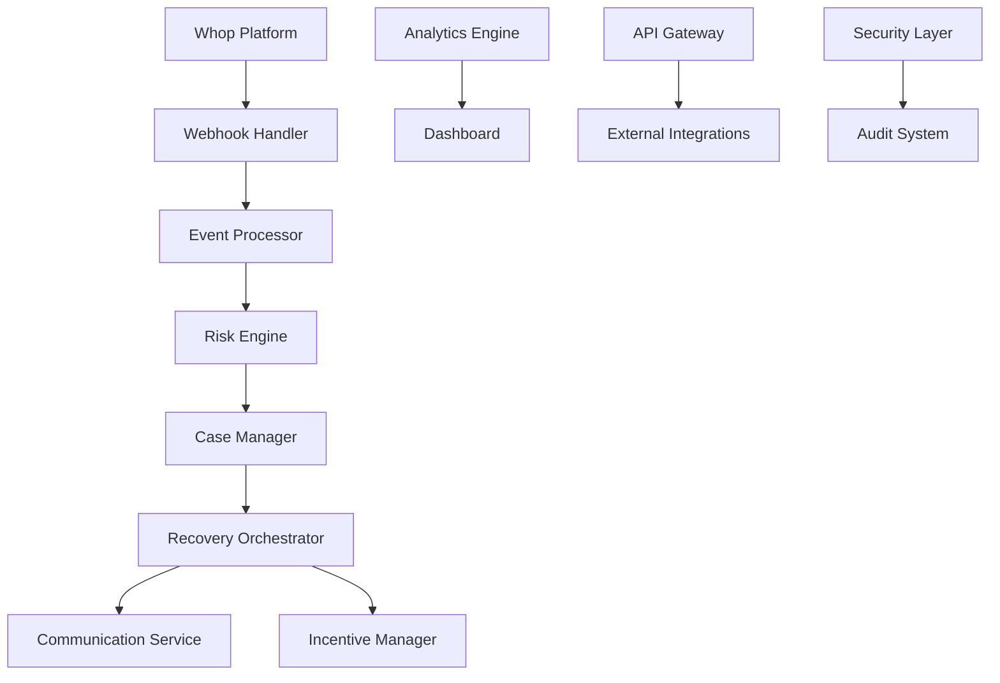

# Churn Saver Overview

Churn Saver is an intelligent customer retention platform that automatically identifies at-risk customers and implements targeted recovery strategies to maximize customer lifetime value and reduce revenue churn.

## What is Churn Saver?

Churn Saver combines machine learning, behavioral analytics, and automated intervention to:

- **Predict churn risk** in real-time using payment behavior and usage patterns
- **Create recovery cases** automatically when customers show risk signals
- **Execute personalized recovery campaigns** with incentives and communication
- **Provide comprehensive analytics** on retention performance and ROI
- **Ensure compliance** with GDPR, CCPA, and other privacy regulations

## Key Features

### 🤖 Intelligent Recovery System

- **Real-time Risk Assessment**: Monitors payment events, usage patterns, and customer behavior
- **Automated Case Creation**: Instant case generation for high-risk customers
- **Multi-channel Recovery**: Email, SMS, and in-app recovery campaigns
- **Personalized Incentives**: Flexible discount and credit programs
- **Success Tracking**: Complete recovery lifecycle monitoring

### 📊 Advanced Analytics Dashboard

- **Executive KPIs**: Recovery rates, revenue impact, and ROI metrics
- **Customer Insights**: Risk segmentation and behavioral analysis
- **Incentive Performance**: Budget utilization and effectiveness tracking
- **Operational Monitoring**: System health and performance metrics
- **Custom Reporting**: Flexible analytics and export capabilities

### 🔒 Enterprise-Grade Security

- **Data Encryption**: AES-256 encryption at rest and in transit
- **Compliance Ready**: GDPR, CCPA, SOC 2, and ISO 27001 compliant
- **Audit Logging**: Comprehensive audit trails for all activities
- **Access Control**: Role-based permissions and multi-factor authentication
- **Data Privacy**: Right to erasure, portability, and rectification

### 🔌 Extensible API Platform

- **RESTful APIs**: Complete programmatic access to all features
- **Webhook Integration**: Real-time event notifications
- **Third-party Integrations**: CRM, email marketing, and analytics platforms
- **SDK Support**: JavaScript/TypeScript and Python SDKs
- **Rate Limiting**: Configurable API limits and abuse prevention

## How It Works

### 1. Data Ingestion
Churn Saver integrates with Whop's payment platform to receive real-time event data:

- Payment failures and declines
- Subscription cancellations
- Plan downgrades
- Usage pattern changes

### 2. Risk Assessment
Machine learning algorithms analyze customer behavior to predict churn probability:

- **Payment History**: Success rates, failure patterns, payment methods
- **Usage Metrics**: Feature adoption, login frequency, engagement scores
- **Account Signals**: Account age, plan type, support interactions
- **External Factors**: Market conditions, seasonal patterns

### 3. Recovery Execution
When risk exceeds thresholds, automated recovery campaigns begin:

- **Immediate Response**: Within minutes for critical cases
- **Multi-channel Outreach**: Email sequences, SMS reminders, in-app notifications
- **Incentive Offers**: Personalized discounts, credits, or feature upgrades
- **Escalation Paths**: Progressive campaign intensity based on engagement

### 4. Success Measurement
Complete ROI tracking and performance analytics:

- **Recovery Rates**: Percentage of successful customer retention
- **Revenue Impact**: Net revenue recovered vs. incentive costs
- **Time Metrics**: Speed of recovery and response times
- **Channel Effectiveness**: Performance by communication channel

## Business Benefits

### Revenue Protection
- **Reduce churn by 15-30%** through proactive intervention
- **Recover lost revenue** with automated win-back campaigns
- **Maximize CLV** by retaining high-value customers longer
- **Optimize costs** with data-driven incentive allocation

### Operational Efficiency
- **24/7 automated recovery** without manual intervention
- **Scalable processing** handles thousands of recovery cases daily
- **Self-service analytics** for business intelligence
- **Integration-ready** with existing CRM and marketing platforms

### Customer Experience
- **Proactive support** before customers leave
- **Personalized offers** based on individual behavior
- **Frictionless recovery** with one-click reinstatement
- **Privacy-respecting** data handling and consent management

## Technical Architecture

### Core Components

### Data Flow

1. **Event Ingestion**: Webhooks receive events from Whop
2. **Data Processing**: Events normalized and enriched with customer data
3. **Risk Calculation**: ML models assess churn probability
4. **Case Creation**: Recovery cases generated for high-risk customers
5. **Campaign Execution**: Automated recovery sequences initiated
6. **Response Tracking**: Customer engagement and success metrics collected
7. **Analytics**: Performance data processed for reporting

### Technology Stack

- **Backend**: Node.js, TypeScript, Next.js
- **Database**: PostgreSQL with Prisma ORM
- **Cache**: Redis for session and data caching
- **Infrastructure**: AWS (ECS, RDS, ElastiCache, CloudFront)
- **Security**: AES-256 encryption, JWT authentication, AWS WAF
- **Monitoring**: DataDog, Sentry, CloudWatch

## Compliance & Security

### Regulatory Compliance

- **GDPR**: Complete data protection and privacy rights implementation
- **CCPA**: California Consumer Privacy Act compliance
- **SOC 2**: Security, availability, and confidentiality controls
- **ISO 27001**: Information security management standards

### Security Features

- **End-to-end encryption** for all sensitive data
- **Multi-factor authentication** for admin access
- **Role-based access control** with granular permissions
- **Comprehensive audit logging** for all system activities
- **Automated security monitoring** and threat detection
- **Regular security assessments** and penetration testing

## Getting Started

### Quick Start for Developers

1. **Clone the repository** and set up your development environment
2. **Configure environment variables** for local development
3. **Install dependencies** and run database migrations
4. **Explore the API** with our interactive documentation
5. **Build your first integration** using webhooks or REST APIs

### Quick Start for Business Users

1. **Connect your Whop account** to enable data ingestion
2. **Configure recovery rules** based on your business needs
3. **Set up incentive programs** with budget and eligibility rules
4. **Monitor performance** through the analytics dashboard
5. **Optimize campaigns** based on real-time insights

## Use Cases

### SaaS Companies
Automatically recover failed subscription payments and reduce monthly churn with personalized win-back campaigns.

### E-commerce Platforms
Identify customers at risk of not returning and offer targeted incentives to encourage repeat purchases.

### Digital Services
Monitor usage patterns and proactively engage customers showing signs of reduced engagement.

### Enterprise Software
Large-scale customer retention with advanced analytics and custom recovery workflows.

## Success Metrics

### Key Performance Indicators

- **Recovery Rate**: >25% of at-risk customers successfully retained
- **Response Time**: <1 hour for critical cases, <4 hours for high-risk
- **ROI**: >300% return on incentive investment
- **Time to Recovery**: <7 days average recovery time
- **Customer Satisfaction**: >90% positive feedback on recovery experience

### Industry Benchmarks

| Industry | Average Churn Rate | Potential Reduction |
|----------|-------------------|-------------------|
| SaaS | 5-10% monthly | 20-40% |
| E-commerce | 20-30% annual | 15-25% |
| Digital Services | 10-20% monthly | 25-35% |

## Next Steps

- **[Setup Guide](setup.md)**: Get started with local development
- **[Architecture](architecture.md)**: Deep dive into system design
- **[API Reference](../api/rest-api.md)**: Complete API documentation
- **[Security Overview](../security/overview.md)**: Security architecture and compliance

## Support

- **Documentation**: Comprehensive guides and API reference
- **Community**: GitHub Discussions for questions and peer support
- **Support**: Email support for technical and business inquiries
- **Status**: Real-time system status and incident updates

---

*Churn Saver: Intelligent customer retention that pays for itself.*